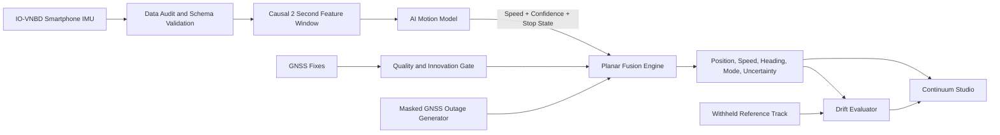
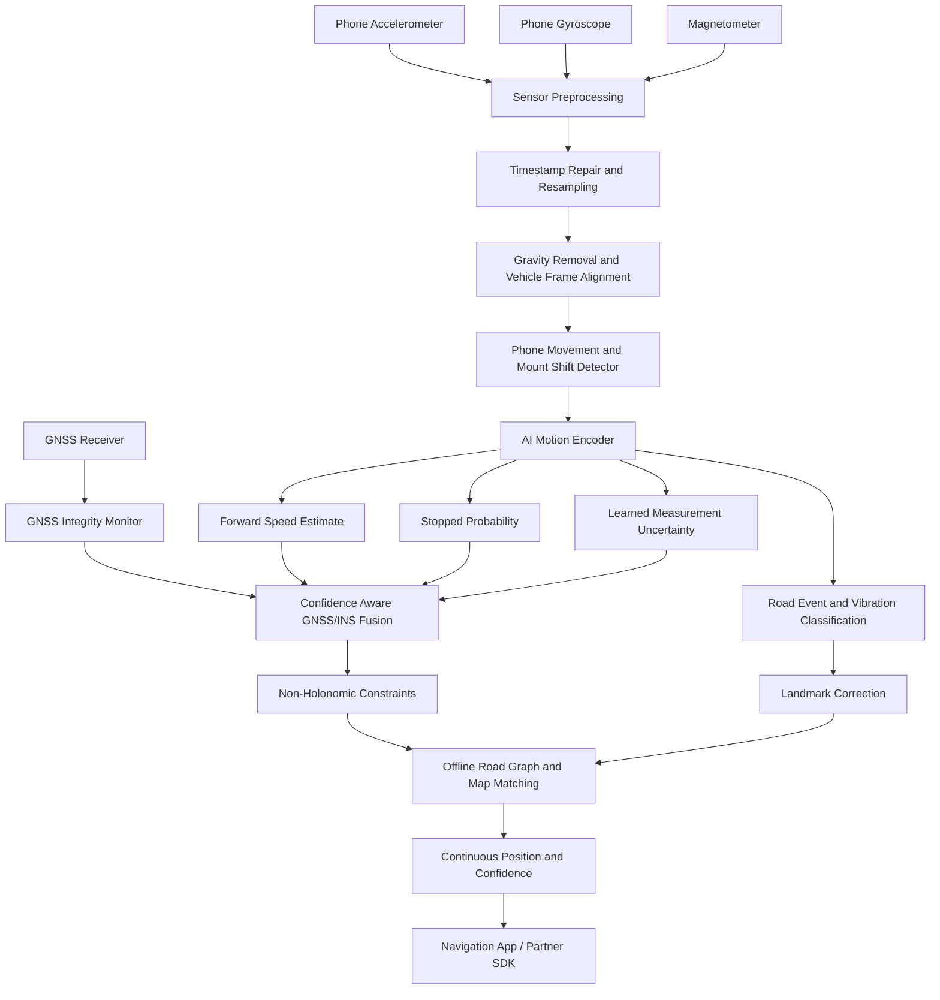
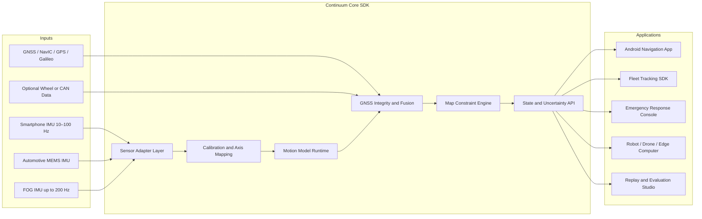

# Continuum IDR — Technical Content for SIH Presentation

## 1. Solution Overview

**Continuum IDR** is an AI assisted, map constrained GNSS–INS fusion platform that converts a smartphone or external IMU into a continuous vehicle navigation engine.

When GNSS becomes weak, unavailable, jammed, or unreliable, Continuum IDR maintains the vehicle trajectory using inertial sensing, learned vehicle motion, kinematic constraints, uncertainty aware sensor fusion, and road network intelligence. When GNSS becomes reliable again, the engine performs a smooth, gated recovery without abruptly moving the navigation marker.

### One-line pitch

> A self-calibrating, confidence aware inertial navigation SDK that keeps vehicles positioned during GNSS outages using smartphone IMU, AI motion estimation, sensor fusion, and road constraints.

### Primary users

- Logistics and fleet management
- Ride hailing and quick commerce
- Emergency response vehicles
- Motorcycles, scooters, cars, buses, and trucks
- Navigation SDK and map application providers
- Robots, drones, and systems using external IMUs

---

## 2. Problems Addressed

### Core problem statement coverage

- GNSS loss in tunnels, underpasses, parking structures, forests, and urban canyons
- Smartphone MEMS bias, thermal drift, scale error, and random noise
- Position error caused by raw acceleration double integration
- Engine vibration, road roughness, potholes, braking, and mounting vibration
- Unknown phone pitch, roll, yaw, and accidental phone movement
- Navigation without OBD-II, wheel speed, or vehicle CAN access
- Instant transition between GNSS aided INS and dead reckoning
- Smooth GNSS reacquisition without position jumps
- Smartphone inference at approximately 10 Hz and external IMU compatibility

### Additional real-world problems addressed by the proposed platform

- Bad GNSS fixes caused by multipath and reflected satellite signals
- Spoofing and jamming indicators through GNSS innovation monitoring
- Stop-and-go traffic and low-speed crawling
- Flyover versus service-road ambiguity
- Parallel roads and divided carriageways
- Two-wheeler lean and high mount vibration
- Loose holders and phone orientation changes
- Magnetometer disturbance near vehicles and metal structures
- Missing or stale map segments
- Uneven sensor timestamps and dropped samples
- Different phone brands, sampling rates, sensor quality, and mounting positions
- Honest navigation confidence during long outages

---

## 3. System Architecture A — Current Reproducible Prototype



### Prototype data flow

1. Discover and audit synchronized phone and vehicle recordings.
2. Validate schemas, row counts, timestamps, coordinates, and sensor availability.
3. Create causal IMU windows using accelerometer and gyroscope measurements.
4. Estimate vehicle speed and stopped state using a lightweight ML model.
5. Fuse motion estimates with available GNSS in a planar navigation filter.
6. Gate implausible GNSS fixes using the filter innovation.
7. Suppress GNSS during simulated outages and continue inertial tracking.
8. Propagate covariance to produce navigation uncertainty.
9. Compare the estimate with withheld reference data after inference.
10. Replay the result in an offline demonstration dashboard.

### Prototype implementation status

- Dataset discovery and automated auditing — **Implemented**
- Causal phone IMU feature extraction — **Implemented**
- ML vehicle speed estimation — **Implemented**
- Stop-state classification — **Implemented**
- GNSS/IMU planar fusion engine — **Implemented**
- GNSS innovation gating — **Implemented**
- Simulated GNSS blackout evaluation — **Implemented**
- Position and uncertainty output — **Implemented**
- SDK-style Python interface — **Implemented**
- Offline replay dashboard — **Implemented**
- Per-outage metrics and plots — **Implemented; final held-out regeneration pending**

---

## 4. System Architecture B — Target Smartphone Edge Engine



### Target on-device processing pipeline

#### Sensor preprocessing

- Monotonic timestamp validation
- Fixed-rate interpolation and resampling
- Anti-aliasing and low-pass filtering
- Gravity compensation
- Bias and scale-factor correction
- Outlier and shock suppression
- Coordinate conversion from phone frame to vehicle frame

#### In-vehicle alignment

- Pitch and roll from the gravity vector
- Vehicle forward direction from acceleration/braking episodes
- Gyroscope-assisted yaw alignment
- Principal Component Analysis for dominant motion direction
- Mount-change detection from gravity and motion-vector discontinuities
- Automatic re-alignment after the phone is moved

#### AI motion understanding

- 1D CNN, Temporal Convolutional Network, or GRU motion encoder
- Forward-speed regression
- Heteroscedastic uncertainty prediction
- Stop/crawl/moving state classification
- Pothole, speed-breaker, and vibration-event recognition
- Vehicle and mount profile adaptation
- Quantized TFLite or ONNX Runtime Mobile inference

#### Sensor fusion

- Extended or Unscented Kalman Filter
- Learned pseudo-measurements from the motion model
- GNSS innovation gating using normalized innovation squared
- Zero Velocity Updates during confident stops
- Non-Holonomic Constraints for lateral and vertical velocity
- Adaptive covariance based on model and sensor quality
- Continuous propagation during GNSS outages
- Progressive GNSS recovery and state correction

#### Road intelligence

- Offline OpenStreetMap road graph
- Heading and road-curvature constraints
- Hidden Markov Model candidate-road selection
- Along-road distance estimation
- Turn and roundabout sequence matching
- Flyover, service-road, and parallel-road disambiguation
- Speed-breaker and road-feature landmarks

---

## 5. System Architecture C — Portable SDK and External IMU Platform



### Portable SDK contract

```python
engine = IDREngine(config, motion_model)
engine.on_imu(imu_sample)
engine.on_gnss(gnss_fix)       # Optional during an outage
state = engine.get_state()
```

### Navigation state output

- Latitude and longitude
- Local east/north coordinates
- Forward speed
- Heading
- Horizontal uncertainty
- GNSS quality and rejection reason
- Tracking mode: initializing, GNSS aided, dead reckoning, or recovering
- Sensor and model confidence
- Outage duration and estimated travelled distance

---

## 6. Feature Matrix

| Capability | Technical method | Status |
|---|---|---|
| Dataset quality audit | Schema checks, row-count checks, coordinate and timestamp validation | Implemented |
| Vehicle speed from phone IMU | Causal window features plus gradient-boosted regression | Implemented |
| Stop detection | Probabilistic binary classifier | Implemented |
| GNSS/INS fusion | Planar covariance-based fusion engine | Implemented |
| Bad GNSS rejection | Innovation residual and statistical gating | Implemented |
| GNSS blackout simulation | Measurement masking with withheld reference scoring | Implemented |
| Uncertainty estimation | State covariance propagation plus model error bins | Implemented |
| Offline demo replay | FastAPI and local HTML/CSS/JavaScript dashboard | Implemented |
| Phone-to-vehicle alignment | Gravity vector, PCA, and motion direction estimation | Target module |
| Phone-moved recovery | Change-point detection and automatic re-alignment | Target module |
| Map matching | OSM graph, heading constraints, and HMM | Target module |
| Zero velocity updates | Stop-confidence constrained speed update | Target module |
| Self-calibration | GNSS-supervised online scale and bias adaptation | Target module |
| Smooth GNSS re-entry | Progressive measurement weighting and covariance reduction | Target module |
| Landmark correction | Turn, speed-breaker, and road-curvature signatures | Research differentiator |
| Two-wheeler adaptation | Lean-aware orientation and vehicle profile model | Research differentiator |
| Spoofing/jamming resilience | GNSS consistency, innovation, and signal-quality monitoring | Target module |
| Android on-device inference | Quantized TFLite/ONNX model and native sensor service | Deployment roadmap |
| External IMU operation | Configurable axes, rates, noise models, and sensor adapters | Deployment roadmap |

---

## 7. AI/ML and Navigation Methods

### Learning methods

- Time-series regression
- Causal sliding-window inference
- Gradient-boosted decision trees for the P0 baseline
- 1D convolutional and recurrent networks for the mobile model roadmap
- Multi-task learning for speed, stop state, events, and uncertainty
- Domain adaptation across phones, mounts, vehicles, and road surfaces
- Self-supervised pretraining on unlabelled IMU streams
- Online calibration while trustworthy GNSS is available
- Quantization-aware training for mobile deployment

### Navigation and estimation methods

- Strapdown inertial navigation concepts
- Local tangent-plane coordinate conversion
- Extended/Unscented Kalman filtering
- Covariance propagation
- Statistical innovation gating
- Zero Velocity Updates
- Non-Holonomic Constraints
- Adaptive process and measurement noise
- Confidence-weighted pseudo-measurements
- Dead reckoning with smooth GNSS reacquisition
- Hidden Markov map matching
- Along-road particle or graph-constrained estimation

### Signal-processing methods

- Resampling and timestamp repair
- Gravity separation
- Low-pass and band-pass filtering
- Shock and transient suppression
- Bias estimation from stationary intervals
- Orientation and axis calibration
- Window statistics and spectral energy features
- Change-point detection for mount movement
- Vibration signatures for road-event detection

---

## 8. Technology Stack

### Current prototype stack

| Layer | Technology |
|---|---|
| Language | Python 3.10+ |
| Data processing | NumPy, pandas |
| Machine learning | scikit-learn, joblib |
| Fusion engine | NumPy-based state estimation |
| API and Studio server | FastAPI, Uvicorn |
| Dashboard | HTML5, CSS3, vanilla JavaScript, SVG/Canvas-style trajectory rendering |
| Testing | pytest |
| Packaging | setuptools and `pyproject.toml` |
| Dataset | IO-VNBD synchronized smartphone and vehicle data |
| Artifacts | JSON, CSV, PNG, persisted model bundles |

### Target production stack

| Layer | Proposed technology |
|---|---|
| Mobile app | Kotlin, Android SensorManager, Fused Location Provider |
| Mobile inference | TensorFlow Lite or ONNX Runtime Mobile |
| Native high-rate engine | C++ core with JNI/Kotlin bindings |
| Offline maps | OpenStreetMap, MBTiles, Valhalla/GraphHopper compatible graph |
| Model training | PyTorch, MLflow/DVC for experiment and data versioning |
| Edge API | C/C++, Python, Android, and ROS adapters |
| Visualization | MapLibre/Leaflet based navigation interface |
| Observability | Structured event logs, inference timing, sensor-health telemetry |
| Optimization | INT8 quantization, model pruning, fixed-size buffers, SIMD |

---

## 9. Evaluation and KPIs

### Navigation metrics

- Endpoint position error in metres
- Drift as percentage of outage distance
- Root Mean Square position error
- Maximum and 95th-percentile error
- Along-track and cross-track error
- Heading error
- Speed MAE and RMSE
- Time to recover after GNSS returns
- GNSS bad-fix rejection rate
- Uncertainty calibration and coverage

### Deployment metrics

- Update rate
- Model size
- Inference latency
- Memory consumption
- CPU and battery usage
- Dropped-sample tolerance
- Cold-start and initialization time

### Required experiment design

- 50 m, 500 m, and 1 km simulated GNSS outages
- Driver/session separated training, validation, and testing
- Frozen-position baseline
- Last-speed-plus-gyro baseline
- Component ablation: ML speed, ZUPT, fusion, map constraints, and calibration
- Median and 95th-percentile reporting rather than a single best route
- Indian-road and two-wheeler field trials as a separate validation stage

---

## 10. Key Differentiators

1. **Speed without OBD:** estimates vehicle motion using only consumer phone sensors.
2. **Road as a virtual sensor:** road geometry, turns, and landmarks constrain inertial drift.
3. **Confidence aware fusion:** the ML model produces a measurement and trust level for the navigation filter.
4. **Continuous fusion:** GNSS is treated as an optional measurement, enabling instant outage handling.
5. **Self-calibration:** trustworthy GNSS supervises phone, mount, and vehicle adaptation before an outage.
6. **GNSS integrity monitoring:** suspicious fixes are down-weighted instead of causing position jumps.
7. **India-oriented road intelligence:** stop-and-go traffic, speed breakers, flyovers, potholes, and two-wheelers are included in the target design.
8. **SDK-first design:** one engine can serve mobile apps, fleet platforms, robots, and external IMU systems.
9. **Uncertainty first navigation:** every position includes a confidence estimate for safer user decisions.
10. **Reproducible evidence:** dataset audit, split policy, outage generator, metrics, baselines, and replay artifacts are part of the system.

---

## 11. Prototype Video Flow

1. **Problem:** show the navigation dot freezing when GNSS enters a tunnel.
2. **Architecture:** display Smartphone IMU → AI Motion Model → Fusion → Road Constraint → Continuous Position.
3. **Normal operation:** Studio shows GNSS aided tracking.
4. **Outage:** activate the blackout; GNSS becomes unavailable while Continuum IDR continues.
5. **Evidence:** show the reference, estimated trajectory, uncertainty, error, and baseline comparison.
6. **Recovery:** GNSS returns and the engine transitions through recovery without an abrupt jump.
7. **Results:** display the held-out drift table and model speed metrics.
8. **Scalability:** end with smartphone, fleet SDK, external IMU, and Android deployment architecture.

---

## 12. Honest Presentation Note

Use the **Status** column in the feature matrix when preparing slides. Present implemented features as the working prototype, target modules as the next SIH build stage, and research differentiators as the innovation roadmap. This gives the presentation strong technical depth while keeping every live-demo claim verifiable.
