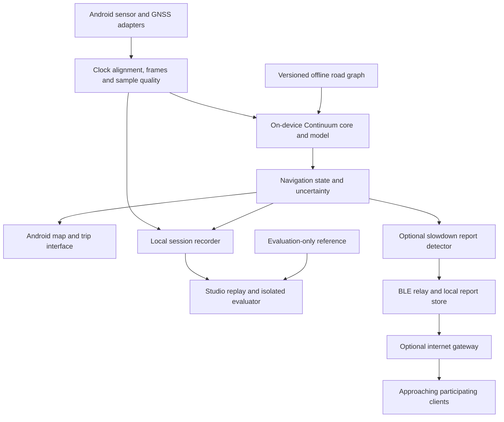

# Continuum: plan from research prototype to working product

**Prepared:** 30 September 2026  
**Basis:** current repository inspection, a fresh Python test run, the supplied SIH problem statement, and the discussions about Indian roads, synthetic data, Android integration and traffic relaying.  
**Status:** implementation plan. Targets below are proposed acceptance criteria, not achieved results. This document does not declare the planned features implemented.

## 1. Product decision

Build **Continuum**, an Android trip companion powered by an embeddable positioning SDK. A driver starts a trip with a mounted phone; the engine estimates position, speed, heading and uncertainty, continues through GNSS interruptions, and accepts returning fixes through a recovery policy. An optional cooperative-awareness module shares recent slowdown reports with participating nearby devices and an internet gateway when available.

The first user is a mounted-phone passenger-car driver or a developer of a fleet/delivery app. The first supported deployment is a named Android phone and a documented car/mount configuration. Expand the supported domain through new measurements, rather than calling every vehicle profile production-ready.

The product has four concrete deliverables:

| Deliverable | What somebody can actually do with it |
| --- | --- |
| **Android APK** | Install, check sensor readiness, record a real trip, run the estimator locally, view an offline map, review and export the trip. |
| **Android SDK and sample integration** | Add an AAR dependency to a second app and consume navigation states without using Continuum's screens. |
| **Continuum Studio and developer portal** | Import actual phone recordings, reproduce failures, compare models, inspect evidence, and follow tested integration guides. |
| **Optional traffic-sharing module** | Exchange short-lived slowdown reports between real phones; use an internet gateway to reach distant approaching clients. |

The phone itself is the initial hardware platform. No custom circuit board is needed to establish a useful deliverable. A roadside gateway or external IMU becomes a separate extension with its own demonstration and evidence.

**First visible milestone:** an APK recording and displaying actual phone sensors and GNSS with the laptop disconnected. **First navigation milestone:** the APK runs the real model and estimator locally through a controlled GNSS-withholding experiment. The first milestone is useful but must not be described as successful dead reckoning.

## 2. Current situation: what the code actually supports

Read-only inspection on this date found a clean Git worktree before this plan was added. `python -m pytest tests/` completed with **78 passed in 36.40 seconds**. It also emitted an asyncio configuration deprecation notice and a physical-core discovery warning. No Android build, road drive or new accuracy evaluation was performed for this plan.

| Component | Observed evidence | Consequence for delivery |
| --- | --- | --- |
| Python estimator and trained model | [engine](continuum_idr/engine.py), [model](continuum_idr/model.py), [training](continuum_idr/training.py), [manifest](models/motion_p0/manifest.json) | Reuse as research reference; diagnose accuracy before promotion. Training uses a histogram gradient-boosted speed regressor and a logistic-regression stop classifier. |
| Interactive recorded-sensor runtime | [runtime](continuum_idr/runtime.py), [runtime tests](tests/test_runtime.py) | Real calculations from recorded measurements, with causal input withholding. Useful development infrastructure. It has no live-phone source. |
| Studio and driver page | [desktop client](continuum_idr/studio_static/app.js), [driver client](continuum_idr/studio_static/mobile.js) call `/api/runtime` | Frontend connection exists in code, despite older documentation saying otherwise. Browser behaviour was not rechecked visually in this planning task. |
| Android packaging | [android directory](android/) contains two Kotlin files and a README | No Gradle app project or buildable APK is provided there. Create the application and library modules. |
| Android motion inference | [location engine](android/ContinuumLocationEngine.kt) sends `DoubleArray(42) { 0.0 }` into prediction | This is a placeholder input path, not the trained sensor pipeline. Replace it before any on-device ML claim. |
| Portable export | [exporter](continuum_idr/portable_model.py) creates empty tree lists; [saved JSON](models/portable/motion_portable.json) has empty speed/stop trees and no linear weights | The exported artifact does not contain the trained speed model or stop classifier. Implement real export and fail explicitly for unsupported models. |
| Kotlin model reader | [runner](android/PortableTreeRunner.kt) expects top-level feature names and nested trees, unlike the current Python JSON | Agree on one versioned format. Export logistic coefficients for the actual stop classifier; do not assume every model is a tree ensemble. |
| Portable-model tests | [tests](tests/test_portable_model.py) test heuristics, serialization and output ranges | Passing these does not establish scikit-learn-to-Kotlin numerical parity. Add genuine cross-runtime fixtures. |
| Map matching | [map module](continuum_idr/maps.py) scores distance, heading and a same-segment continuity bonus | Reusable baseline. It is not yet evidence of full causal road-sequence inference on a real offline road pack. |
| High-rate path | [scheduler](continuum_idr/scheduling.py) forwards IMU events and counts decimation intervals | Counting model triggers does not establish actual resampling, model cadence or 200 Hz positioning accuracy. Inspect and verify the full path. |
| Traffic communication | No Bluetooth/mesh traffic implementation found in the inspected Android/Python source | New optional module, with physical-device tests required. |
| Build environment | Python 3.10 and Java 17 found on PATH; adb/kotlinc not found there; usual user Android SDK directory absent | Locate any alternative SDK or provision the Android toolchain in the first milestone. These checks do not prove no SDK exists elsewhere. |

The Android reference code also requires lifecycle review: it initializes coordinates to zero, uses a fixed gyro axis, updates IMU integration timing only during fallback, and directly replaces coordinates on GNSS return. Permission errors and missing sensors need explicit user-visible states. These observations explain why copying the existing two files is insufficient to ship an app.

### Accuracy baseline to preserve

The existing [evaluation summary](artifacts/evaluation/summary.json) records:

| Measurement | Current artifact |
| --- | ---: |
| Experiment | `iovnbd-vtb-heldout-p0` |
| Test runs declared | 11 |
| Runs with accepted outages in `by_run` | 8 |
| Accepted outage windows | 34 |
| Excluded candidate windows | 98 |
| Median endpoint error | 354.25 m |
| Median distance-normalized drift | 80.32% |
| Below-10% pass rate | 0% |
| Last-speed-plus-gyro median endpoint error | 334.45 m |
| Frozen-position median endpoint error | 496.88 m |

These are historical artifact values, not measurements from the current Android source. File/family counts are not automatically independent journeys. Preserve the original artifact while auditing its assumptions. A corrected evaluator must have a new version and a documented comparison, not silently replace history.

The evaluator currently infers fresh fixes from coordinate changes, interpolates phone GNSS for scoring, and derives distance from integrated phone GNSS speed. Its existing duration/sample-gap/fix-count gates need a further reference-quality review. A sample timestamp gap check does not establish a maximum fresh-GNSS gap. Phone GNSS is a finite-accuracy screening reference, especially problematic for proving a 5 m threshold.

## 3. Scope and release boundaries

| Release | User outcome | Evidence required |
| --- | --- | --- |
| **R0: real phone recorder** | Install an app, record a trip, view sensor readiness and measured GNSS, export data. | APK installation and a real-device recording imported into Studio. |
| **R1: mounted-car navigation demonstrator** | Local model and estimator, offline map, GNSS loss/recovery, uncertainty, trip review, embeddable SDK. | Export parity, real-device timing, honest IO-VNBD results and held-out local-drive results. |
| **R2: robustness and cooperative awareness** | Measured disturbance handling and optional phone-to-phone slowdown warnings. | Real event-labelled recordings, navigation ablations, physical relay and gateway evidence. |
| **R3: broader problem-statement coverage** | Validated two-wheeler, parking/ramp and external-IMU profiles. | Domain-specific recordings, references, performance and integration reports. |

R0/R1 establish a tangible product. R2 makes it more useful and distinctive. R3 remains part of the final problem-statement ambition, with separate gates rather than an unsupported universal-compatibility claim.

Keep full turn-by-turn routing, floor identification, guaranteed 10 km offline delivery, automatic integration into the installed Google Maps app, and universal handheld-phone support out of the first release. A selected route or offline route preview is sufficient for the initial navigation demonstrator; route guidance is a separate feature.

## 4. Driver, evaluator and developer experiences

### Android driver experience

1. **Prepare:** select/download an allowed offline region; review sensor availability, model/profile compatibility and permissions. Select the supported mount profile.
2. **Start trip:** establish an absolute anchor and sufficient heading/alignment confidence. Show why the engine is waiting if the conditions are insufficient.
3. **Drive:** map, estimated speed, heading, position-quality status and a compact uncertainty indication. Keep connectivity separate from positioning status.
4. **GNSS interruption:** continue the existing estimator, grow uncertainty and explain degraded confidence. Missing-signal detection follows observed fix cadence; it is not an instant RF-failure detector.
5. **Recovery:** record first returned and first accepted fixes, apply the validated recovery policy and return to aided tracking.
6. **Finish:** save the trip, show coverage and interruptions, and permit export/delete. Show measured error only when a suitable evaluation reference exists.

A passenger/operator enables testing controls. In evaluation mode, withholding GNSS blocks estimator inputs while a separate logger can retain the receiver observations for later scoring. Clearly label this as a controlled outage. Actual receiver loss is logged separately.

### Studio experience

Retain recorded-sensor replay as the regression laboratory. Add actual Android session import, model/config/map provenance, failure comparison, source-rate plots, uncertainty/error comparison, and exportable reports. Optional live phone telemetry is a diagnostic mirror: stopping the laptop connection must not stop phone inference.

Give every session an explicit source: `live_phone`, `recorded_phone`, `recorded_iovnbd` or `synthetic`. Keep precomputed historical benchmarks distinct from current sessions. Do not present reference trajectories as road geometry.

### Developer experience

Publish a versioned local SDK package, a minimal independent sample app, tested quickstarts, actual API contracts, clock/frame/unit explanations, supported-device evidence, troubleshooting and a model compatibility table. Generate example outputs from the packaged implementation. A second app using the AAR is the integration proof.

## 5. Architecture and technology choices



**Proposed implementation choices:** Kotlin Android app and a pure Kotlin core library for the first mobile release; Python retained for training, evaluation and the edge reference; a faithful portable representation of the existing speed trees and logistic stop classifier; MapLibre Native for map rendering; local files plus a small session index for storage; existing FastAPI Studio for development and optional gateway experiments. Pin compatible dependency/toolchain versions when creating the build.

MapLibre provides an Android SDK and offline-region APIs, making it a candidate for the app's local map view. Verify the chosen packaging path on the actual target device. [Android quickstart](https://maplibre.org/maplibre-native/android/examples/getting-started/), [offline API](https://maplibre.org/maplibre-native/android/api/-map-libre%20-native%20-android/org.maplibre.android.offline/index.html).

Use an independently prepared road graph for matching and rendering assets for display. Package required styles, fonts and sprites too. Use a source explicitly allowing offline distribution or generate permitted assets; the standard OSM raster server prohibits offline bulk downloading. Preserve map attribution and review the chosen data/provider licence. [OSM tile policy](https://operations.osmfoundation.org/policies/tiles/).

Do not add a native C++ rewrite or neural-network runtime solely for presentation. Reconsider a shared native core if parity maintenance or measured performance justifies it. Python and Kotlin are separate implementations until equivalence is established through shared fixtures and trajectory comparisons.

### Proposed module structure

```text
android/
  app/                 driver UI, permissions, trip service and recording
  continuum-core/      numerical estimator, preprocessing and model runner
  continuum-android/   sensor/location adapters and lifecycle integration
  continuum-traffic/   optional reports, BLE transport and gateway adapter
  sample-integration/  second app consuming the library
continuum_idr/         existing Python research, evaluation and Studio
tests/fixtures/       shared sensor, feature, model and trajectory fixtures
data/manifests/       provenance and grouped split definitions
data/local/           consented recordings; excluded from source control
maps/                 manifests and build recipes; large packs separate
artifacts/releases/   APK/AAR, checksums, reports and model/map identities
```

This is a target layout, not a list of newly created directories. Preserve raw dataset folders and existing research artifacts.

### Contracts to freeze before integration

- Sensor events: monotonic measurement time, arrival time, sensor identity, units, frame, actual sampling intervals and quality flags. GNSS and IMU share a documented clock mapping.
- Missing channels remain explicitly missing. Validate staleness when combining asynchronous accelerometer, gyro and gravity events.
- Navigation output: nullable position before initialization, speed/heading validity, estimated uncertainty, tracking mode, alignment/health flags and provenance. No true-error field in the runtime SDK.
- Model pack: schema version, actual weights, ordered features, preprocessing version, sample/window rates, axes, clipping, missing-value routing, stop classifier and uncertainty calibration.
- Session export: raw inputs, delivered/withheld GNSS decisions, predictions, control events, dropped-sample counts and hashes. Reference data occupies a separate evaluator-only stream.
- Phone execution continues in a user-started foreground trip service. Implement permissions and lifecycle behaviour against the selected Android versions; verify screen-off, interruption and process-restart behaviour. [Android foreground-service guidance](https://developer.android.com/develop/background-work/services/fgs/declare).

## 6. Accuracy work: improve the cause of the drift

### A. Audit before model expansion

On training/validation data, inspect entry error, phone/vehicle clock differences, GNSS speed units, gravity removal, phone-to-vehicle axes, gyro sign, heading initialization, model bias, false stops and recovery rejection. Audit reference jumps, gaps and distance calculation separately from estimator behaviour.

Keep the current split: eligible Driver A and non-Vtb Driver E for training, Driver B for validation, Vtb held out. Repeated use has exposed the legacy benchmark; disclose this and reserve newly collected sessions for a genuinely untouched external check. Check parent-journey duplication across files before calling groups independent. Quarantine S-A4 until a versioned semantic repair is proven.

### B. Controlled experiments

| Experiment | Question | Promotion condition |
| --- | --- | --- |
| Frozen and last-speed-plus-gyro baselines | Are coordinates, initialization and reference scoring sensible? | Reproducible outputs with common entry conditions. |
| Physical propagation without learned speed | Is the model adding useful information? | Understand speed and heading contributions separately. |
| Current direct-speed model | Where do speed bias and false stops dominate? | Report stratified errors and uncertainty coverage. |
| Anchored speed/residual model | Does preserving accepted entry velocity reduce drift? | Better validation rollout results without hidden GNSS or teacher-forcing leakage. |
| Stop, bias and mount handling | Do corrections help without false stops/re-alignments? | Measured ablations on crawling, steady motion and disturbances. |
| Road-sequence matching | Does topology improve position without wrong-road locks? | Compare unconstrained and matched results, including ambiguous/off-map cases. |
| Compact causal TCN, if justified | Does additional temporal modelling beat the simpler model? | Improvement survives device latency, size and held-out checks. |

Learned speed and uncertainty are useful research directions; prior work does not guarantee performance on this sensor configuration. [Learning Car Speed Using Inertial Sensors](https://arxiv.org/abs/2205.07883).

The anchored model must use its own preceding predicted state during outage rollouts. A model trained with the correct reference speed at every step and deployed recursively has a different task. Do not remove the physical ambiguity of straight constant-speed motion from the limitations.

### C. Export and mobile parity are mandatory

Export every supported speed tree, base prediction, thresholds and branch rules, plus logistic-regression coefficients/intercept/class order for stops. Preserve preprocessing, clipping and uncertainty bins. Eliminate silent heuristic substitution when a required model is missing.

Create shared fixtures containing real causal windows, expected 42 features and expected model outputs. Test scikit-learn, portable Python and Kotlin on the same inputs, including threshold boundaries, low speeds and invalid packs. Then compare entire trajectories on identical event streams. Proposed initial model-output tolerances: 1e-4 m/s speed and 1e-5 stop probability; define and freeze a justified trajectory tolerance before evaluating parity. Parity proves reproduction, not navigation accuracy.

## 7. Real data strategy

### Three separate evidence tracks

| Track | Purpose | Rules |
| --- | --- | --- |
| IO-VNBD | Required screening model and benchmark | Keep provenance, historical artifacts, grouped split and full failure reporting. |
| Local Indian-road recordings | Device/mount transfer, events and actual phone deployment | Separate recording sessions and routes for development and evaluation. |
| Synthetic scenarios | Deterministic faults and development coverage | Label clearly; never count them as real Indian-road or field accuracy evidence. |

Assess additional public data only against a specific need: raw inertial channels, clocks, mounting information, sampling rate, labels, reference quality, licence and overlap. RoadSens-4M describes smartphone sensing plus road video and is a candidate for event work; acquisition, actual schema and annotation suitability must be checked first. It is not automatically a precise dead-reckoning benchmark. [Dataset description](https://arxiv.org/abs/2510.25211).

### Local collection pilot

Start with 2-4 hours across multiple short sessions as an engineering pilot, not a statistical generalization claim. Use one securely mounted phone and a passenger/operator. Add another phone/mount and vehicle when available. Do not intentionally strike hazardous potholes or ask the driver to operate recording controls.

Record accelerometer and gyro at a requested 50-100 Hz where supported; record actual delivery intervals, saturation and gaps. Keep GNSS measurement times, speed/course availability and accuracy metadata. Record optional gravity/magnetometer and barometer with their provenance. Android sampling limits and delivered rates require device verification. [Sensor documentation](https://developer.android.com/develop/sensors-and-location/sensors/sensors_overview).

The existing model expects 10 Hz windows. Build a documented causal filter/resampling path to that rate while retaining high-rate raw signals for future event models. Upsampling IO-VNBD does not create the missing road-shock frequencies.

Collect normal road, stationary/idling, smooth constant speed, braking/acceleration, turns, roundabouts, crawl/stop-start, ordinary speed breakers, rough patches and safe mount-change tests. Label events using synchronized passenger annotations/video, with uncertain labels retained. Include negative examples so every acceleration is not classified as a pothole.

Store phone/OS, vehicle, mount, orientation, session/parent ID, route, weather if relevant, sensor conventions, measured rate, reference method and transformation versions. Keep personal trip data local by default; make export/sharing explicit and remove identifying metadata from public evidence.

### Reference quality

- Begin with open-sky GNSS masking. Keep reference observations isolated from inference; disclose that phone GNSS is noisy and may be platform-fused.
- For a 5 m pass claim, obtain a reference with uncertainty sufficiently below the threshold or label the result inconclusive. A second ordinary phone is a cross-check, not automatic ground truth.
- Real tunnels/parking need an independent reference method appropriate to the site, such as surveyed observations or a suitable reference system. RTK GNSS alone does not supply a continuous reference inside a GNSS-denied tunnel.
- Entry/exit checks validate endpoint behaviour only. Report coverage separately from full-trajectory accuracy.
- External reference instruments can be used for evaluation without becoming runtime inputs; preserve the smartphone-only inference experiment.

## 8. Synthetic scenario laboratory

Build a deterministic generator around an underlying vehicle trajectory and orientation. Derive consistent inertial signals, then add sensor/mount effects. Keep truth inaccessible to the runtime adapter. Save generator version, seed, physical parameters and injected events.

| Scenario | Inputs to generate or perturb | Behaviour to measure |
| --- | --- | --- |
| Straight outage | Known entry speed, acceleration changes, gyro bias | Drift growth and honest uncertainty. |
| Turn/roundabout | Consistent trajectory, yaw rate and lateral acceleration | Heading sign, integration and road hypotheses. |
| Speed breaker/rough patch | Plausible vertical/pitch motion with varied vehicle response | Shock handling without false forward motion. |
| Phone rotation | Rotate all relevant sensor/gravity vectors consistently | Detection, degraded alignment and recovery. |
| Queue/crawl | Repeated stops, low speeds, smooth moving segments | False zero-velocity updates and slowdown inference. |
| Parking | Reverse, tight turns, stops and ramps | Explicit unsupported states before extended models exist. |
| GNSS corruption | Dropout, stale/duplicate fixes, jumps, gradual bias, return | Gating, delayed detection and bounded recovery. |
| Timing faults | Jitter, out-of-order delivery, clock resets, missing samples | Bounded queues, rejection and quality flags. |
| Traffic network | Moving peers, radio gaps, duplicate/stale reports | Delivery, expiry, congestion and disconnected behaviour. |

Calibrate signal magnitudes/durations against real training recordings. Randomize event times so a model cannot solve the task by memorizing the schedule. First use the generator for regression tests; introduce training augmentation only after real-data ablations show benefit. Simulated radio propagation and simulated 10 km routes are not field range measurements.

## 9. Road awareness, alignment and parking

Use an offline road graph with connectivity, permitted direction and available bridge/tunnel/layer metadata. Build causal candidate histories using distance, heading, plausible progress and turns. A planned route may be an explicit user prior; the evaluator's future route is forbidden as an inference prior.

Initially expose a road-associated position separately from the unconstrained estimate. Add bounded filter feedback only after wrong-road tests and correlation review. Preserve unmatched and ambiguous states for parallel roads, ramps and absent map geometry.

Validate gravity/tilt and mounting yaw using informative motion and accepted GNSS course. Stationary gravity cannot determine mounting yaw. Treat magnetometer as optional and quality-gated near vehicles. Apply vehicle constraints in the correct frame and relax them during slip, bumps or lean.

Road-event work first protects navigation from shocks. A mapped speed breaker becomes a location correction only with independent landmark coordinates and reliable association. Record unknown shocks instead of confidently assigning an unvalidated pothole label.

Parking extends the model to reverse motion, low-speed heading ambiguity, ramps and potentially 3D/floor state. Optional barometer/floor maps need independent validation. A planar road snap must not select a floor by appearance. Keep this as R3 until references and models exist.

## 10. Cooperative traffic awareness

### Purpose and scope

Warn participating approaching drivers about recent slow traffic even when some reporting vehicles have no internet. This is optional application-level cooperative awareness; it is not certified automotive V2X and does not improve absolute positioning merely by averaging neighbours.

Bitchat is a communication precedent: it documents local BLE relaying and a separate internet transport. Use the architectural idea, not an assumption that a chat app already supplies a validated moving-vehicle traffic protocol. [Bitchat repository](https://github.com/permissionlesstech/bitchat).

### Proposed report and lifecycle

A compact report carries a schema version, unique event ID, origin pseudonym, road-pack/segment identity or approximate area, direction and confidence, observed speed band, observation interval, position uncertainty, expiry and hop budget. Include source type so manual, algorithmic and synthetic reports cannot be confused.

1. Sustained low speed on a plausible road creates a **possible slowdown**. One stopped vehicle is insufficient to establish congestion.
2. Independent observations can strengthen the report. Repeated relays of one origin are still one observation.
3. Peers verify format/authenticity, discard duplicates and stale messages, apply bounded rate/size limits, and relay eligible reports.
4. A gateway uploads consented reports when internet is available. Nearby internet-connected recipients need no mesh path.
5. Recipients filter by route, direction, distance, freshness and uncertainty. Large uncertainty yields an approximate area warning.
6. Expiry/refresh/clear events remove stale warnings. Use a clock-skew policy; do not extend a report's lifetime on each relay.

Use standard cryptographic libraries and authenticated origin messages; signatures identify an origin but do not prove the observation true or prevent one actor inventing many identities. Account for fabricated reports, replay and pseudonym rotation when counting independent sources. Share minimal road-event information rather than persistent full trajectories.

### The 10 km requirement

Treat 10 km as a desired **upstream road-distance warning zone**, not a claimed Bluetooth range. Immediate offline relay requires a connected sequence of participating devices or installed infrastructure. If the chain breaks, store-and-forward introduces delay and may deliver nothing before expiry. An internet gateway can distribute a still-fresh report beyond the local radio chain.

Phones must run compatible software, have necessary permissions and support the required BLE roles. Test discovery, background/screen-off behaviour, battery and connection churn on physical devices. [Android BLE background guidance](https://developer.android.com/develop/connectivity/bluetooth/ble/background).

### Development order

1. Implement report validation, deduplication, expiry and route relevance with an in-process test transport.
2. Implement a local gateway and two-client internet path; measure delivery and stale-report behaviour.
3. Build actual BLE peer discovery and one-hop transfer; then A-to-B-to-C relay with A and C outside direct communication.
4. Verify that suppressing B breaks delivery, proving B actually relays rather than a hidden internet/direct path.
5. Test mobile conditions in a controlled site; report delivery ratio, latency percentiles, range conditions, battery and failures.

A staffed three-phone test is enough for an initial physical relay demonstration. It does not establish 10 km coverage or large-fleet scalability. Add roadside hardware only if deployment requirements justify it.

## 11. Google Maps, NavIC and external integration

| Integration | Planned support and boundary |
| --- | --- |
| Our Android app | Uses Continuum output directly for map position and quality UI; offline assets local. |
| Another developer's app | AAR and example callback/stream adapter; app controls its display and routing. |
| Google map embedded in a developer's app | A custom map `LocationSource` can supply the location layer; verify routing-engine integration separately. |
| Installed Google Maps application | No promised normal plug-in path. Do not base the product on developer mock-location mode. |
| NavIC-capable receiver | GNSS adapter accepts the receiver/platform's fixes with timestamps/provenance; no satellite-side integration. |
| External IMU/edge | Versioned sensor adapter, explicit axes/noise/rate model and independently measured accuracy. |

Google's documented custom source is a map location-layer interface, not evidence of third-party control over the installed Google Maps app or its guidance engine. [LocationSource documentation](https://developers.google.com/maps/documentation/navigation/android-sdk/reference/com/google/android/gms/maps/LocationSource). NavIC is a satellite navigation system supplying signals to compatible receivers. [ISRO overview](https://www.isro.gov.in/Navic.html).

## 12. Work packages and dependencies

Effort ranges are planning estimates for engineers familiar with the relevant stack, not delivery promises. Hardware access, learning time, data/reference acquisition and accuracy research can dominate elapsed time. Deadline, team and device availability were requested during planning; until confirmed, use these staged assumptions.

| ID | Work package | Depends on | Indicative effort | Concrete exit evidence |
| --- | --- | --- | --- | --- |
| W0 | Baseline audit, reproducible environment, truthful status | Existing repo | 2-3 person-days | Pinned environment, preserved artifact hashes, issue register and reproducible checks. |
| W1 | Buildable Android recorder and offline map shell | W0 contracts | 4-7 | Installed APK, real sensors/GNSS, permission failures handled, export and Studio import. |
| W2 | Faithful model export and Kotlin core | W0; W1 integration | 6-10 | Real weights, golden-feature/prediction parity, full-trajectory replay comparison. |
| W3 | On-device trip navigation and SDK sample | W1, W2 | 5-8 | Local inference with laptop disconnected; app lifecycle tests; second integration app. |
| W4 | Reference audit, estimator diagnosis and model experiments | W0; local data improves coverage | 8-15 initially | Validation report, frozen candidate and versioned held-out comparison. Target attainment remains uncertain. |
| W5 | Local data pilot and deterministic synthetic tests | W1; supports W2-W4 | 4-7 engineering days plus recording access | Reviewed manifests, grouped splits, labelled events and reproducible scenarios. |
| W6 | Road matching and disturbance robustness | W3-W5, regional map | 6-10 | Map/no-map and event ablations, ambiguity handling and failure cases. |
| W7 | Traffic reports, gateway and physical BLE relay | Stable W3; first protocol tests can start sooner | 7-12 | Physical multi-hop and gateway logs, expiry/deduplication and adverse tests. |
| W8 | Release packaging, evidence, docs and demo | Selected release gates | 4-6 | APK/AAR/model/map bundle, independent install, test report and recorded demonstration. |
| W9 | Parking, motorcycle and external-IMU expansion | R1 evidence plus equipment/reference access | Scope after pilot; separate research budget | Domain-specific accuracy, timing and reference reports. |

W0-W8 total **46-78 person-days**, with some overlap between roles. A two-person experienced team should reserve roughly **8-12 calendar weeks** for the combined demonstrator, including integration/field time, and revisit after W1/W2. A solo or part-time team should schedule by available person-days; no fixed completion date is supportable yet. Passing the drift benchmark is not guaranteed by this estimate.

Suggested ownership: one Android/integration owner, one estimation/data owner, with a designated field operator and independent evidence reviewer. One person may cover multiple roles. This is a team work allocation, not an instruction to spawn coding agents.

Critical path: **buildable recorder -> faithful model/core -> real phone trip -> accuracy validation -> evidence release**. Traffic sharing may proceed once that path is stable; it must not replace the GNSS-outage work.

## 13. First ten working days: obtain something tangible quickly

This is a suggested sequence for one experienced implementer; adjust once the environment and device are known. Each step produces reviewable evidence rather than a percentage-complete claim.

| Day | Main outcome |
| --- | --- |
| 1 | Preserve baseline artifacts; create issue register; locate/install Android toolchain; choose target phone and supported profile. |
| 2 | Gradle app/library skeleton builds; APK installs; permissions and missing-sensor readiness screen work. |
| 3 | Foreground trip recorder captures monotonic raw sensors and GNSS, with actual rates and source identity. |
| 4 | Export a real session and import it into Studio; demonstrate screen-off logging and clear stop control. |
| 5 | Offline map region and GNSS marker run without internet; record first local passenger-operated trip. R0 review. |
| 6 | Freeze portable model schema and fix Python export for actual speed trees and logistic stop model. |
| 7 | Kotlin inference consumes exported weights; verify golden feature/prediction fixtures. |
| 8 | Port core propagation/fusion and initialization rules; verify recorded-event comparisons. Continue if parity needs more time. |
| 9 | Connect phone sensor adapter and local core; verify causal withholding and actual accepted-fix recovery. |
| 10 | Review first on-phone controlled-outage run, timing and failures; set the next experiment from evidence. |

Do not mark the day-10 navigation outcome complete if model or trajectory parity fails. The recorder remains a useful R0 deliverable while those issues are resolved. Begin validation diagnosis during available time; do not wait for a perfect UI.

If the deadline is under two weeks, prioritise R0 plus whatever verified on-device inference is achievable, the existing honest IO-VNBD evidence and a clear remaining-work register. Defer mesh, parking floors, extra vehicle classes and visual redesign. Do not label a logger as the final solution.

## 14. Acceptance gates and metrics

### Gate A: reproducible software and real inputs

- Fresh checkout plus documented dependencies builds the app and runs the Python suite.
- APK runs on a named physical phone; permissions, absent gyro, denied location and invalid model have explicit outcomes.
- Continuous 30-minute trip logging/processing trial with screen on/off, bounded memory and recorded sample loss; proposed target zero crashes and zero unexplained loss.
- No fabricated coordinates before anchoring. Process death or clock discontinuity causes explicit reinitialization unless a validated recovery policy exists.

### Gate B: honest on-device execution

- Actual trained weights and feature/prediction/trajectory parity reports exist.
- Device executes without the laptop or network; optional diagnostic streaming can disconnect without affecting navigation.
- Target 10 Hz state output when initialized and inputs are healthy; p95 estimator work below 100 ms, with p99, missed deadlines, end-to-end lag and queue growth reported.
- Measure model size, process memory, thermal state and battery change against a GNSS/map-only control on the same device and route conditions.
- Cold-cache/offline test confirms map styles, fonts and data are genuinely packaged.

### Gate C: navigation accuracy

- Report entry error, endpoint error, relative displacement error, maximum/RMSE error, speed/heading error and uncertainty coverage where references support them.
- Report 50 m, 500 m and 1 km outages plus fixed-duration cases; include stopped/crawling tests separately because distance-normalized drift becomes unstable near zero distance.
- Compare methods on the same eligible windows/initialization; publish exclusion reasons and coverage, not only successful windows.
- Proposed intermediate engineering gate: improve validation median endpoint error over last-speed-plus-gyro without worsening p95 or hiding reduced coverage. Freeze the candidate before held-out reporting.
- The supplied benchmark remains **less than 10% drift per evaluated outage**. Report pass counts, denominators and failures; do not declare benchmark success from a favourable median or a cherry-picked route.
- Lane-level performance needs independent lane reference and lateral-error measures; the 10% criterion alone does not establish it.
- Measure first returned fix, first accepted fix, time to recover and correction size. Smooth marker animation does not change estimator errors.

### Gate D: robustness and communication

- Road-event precision/recall and false alarms are reported by event and session; also report their effect on navigation drift.
- Map matching reports wrong-road associations, ambiguity and unmatched coverage, with raw and matched paths retained.
- Relay trials report all attempted sends, physical layout/conditions, latency p50/p95, delivery rate, duplicates, battery and stale-message rejection. Proposed bench target: at least 95% delivery within 5 seconds over 100 small-message trials on the documented three-phone layout; this is not a public-road guarantee.
- Test isolated peers, removed relay, no internet, opposing road directions, old reports, replayed messages and rebooted devices.
- A forwarded message is never counted as a new independent traffic observation. Uncertain congestion is labelled as such.

### Gate E: expanded sensor/domain claims

For 200 Hz external processing, verify actual propagation/model rates and rate conversion, p95/p99 timing, missed 5 ms periods and backlog on named hardware. Then conduct a separate reference-based accuracy evaluation using a real external IMU. Synthetic high-rate throughput is useful but insufficient. Motorcycle and parking claims require their own gate-C evidence.

## 15. Problem-statement coverage

| Supplied requirement | Planned delivery | Proof |
| --- | --- | --- |
| IO-VNBD preliminary model and position plots | Preserve baseline; validate/freeze improved candidates | Model, split manifest, predictions, plots and reproducible commands. |
| In-vehicle alignment/calibration | Mounted-profile preprocessing, yaw confidence and mount recovery | Real mount tests, frame fixtures and alignment/failure logs. |
| AI speed and vibration handling without OBD | Real exported speed model, stop model and validated disturbance handling | No outage GNSS/CAN leakage; model and navigation ablations. |
| AI-assisted GNSS/INS fusion | Learned motion/uncertainty with validated filtering and recovery | Fixed-versus-learned comparisons and uncertainty coverage. |
| Map matching and vehicle constraints | Offline road-sequence hypotheses and appropriate kinematic constraints | Wrong-road, parallel-road, turn, ramp and unmatched tests. |
| Seamless GNSS loss/recovery | Always-running estimator and measured availability detection | Continuous state logs; detection/acceptance/correction times. |
| Mobile navigation interface and 10 Hz output | Native local trip app and offline map | Physical-device APK demonstration and timing evidence. |
| Under-10% outage drift | Accuracy work and frozen evaluation | Per-outage pass/fail table; remains unmet until measured. |
| Lane-level aspiration | Later accuracy/reference programme | Lane-level reference and lateral-error distribution. |
| External IMUs and approximately 200 Hz edge path | Adapter/profile contract, rate-separated engine, real sensor trial | Device-specific timing and separate accuracy evidence. |
| Indian-road robustness | Local sessions and event-labelled tests | Untouched routes/devices where feasible; domain limitations recorded. |
| Traffic relaying | Optional R2 enhancement, beyond core positioning requirement | Physical relay and gateway tests, not navigation-accuracy credit. |

## 16. Equipment and external dependencies

| Need | Minimum practical access | When it matters |
| --- | --- | --- |
| App/core development | Existing laptop, Android SDK/toolchain, USB cable | W1. |
| Real sensor validation | One Android phone with accelerometer and gyro, secure mount | W1-W3; emulator alone insufficient. |
| Local driving data | Passenger car and passenger/operator time | W5 and accuracy tests. |
| Transfer testing | Another phone/mount, later another vehicle | Before broad compatibility claims. |
| Physical mesh | Three compatible phones; fourth client for gateway demonstration | W7. |
| Accurate reference | Borrowed/rented reference equipment or suitable surveyed test arrangement | Strict accuracy/parking/tunnel claims. |
| External-IMU requirement | Access to actual external sensor and reference | W9. |
| Distribution/gateway | Optional hosted service and controlled field connectivity | After local gateway proof. |

No equipment purchases, cloud subscriptions or public deployments are authorized by writing this plan. Prefer existing/borrowed equipment for the first pilot; obtain current quotations only when device/reference needs are settled. A FOG sensor is a separate access/budget dependency, not an assumed asset.

If no phone is available, produce a reproducibly buildable APK and host-side parity tests, but leave the physical-device gate open. If no vehicle/reference is available, complete the logger/core/synthetic work without fabricating field evidence. If only one phone is available, postpone the physical relay claim.

## 17. Risks and decisions that prevent another unfinished prototype

| Risk | Response |
| --- | --- |
| UI work hides a missing runtime | APK/core/real-input milestones precede another website redesign. |
| Passing component tests looks like a finished SDK | Require model parity, full-trajectory checks and physical-device evidence separately. |
| More data amplifies wrong units or labels | Gate datasets by clocks, frames, units and reference quality before training. |
| Held-out results become a tuning loop | Use validation for changes; version final evaluations and reserve new external sessions. |
| Synthetic success fails on real roads | Calibrate from real data and test augmentation on untouched real recordings. |
| Road snapping hides drift | Preserve raw path and report incorrect associations. |
| Peer positions spread correlated errors | Traffic reports remain outside the navigation filter in R2. |
| Mesh works on a desk but fails on moving cars | Physical topology, radio-gap, background and battery tests before range claims. |
| Extra features consume the project | Protect R1; traffic, parking and external profiles have independent gates. |
| Accuracy target remains unmet | Keep a functional research product, publish the failure and next experiment; do not redefine success as animation quality. |

Maintain a small evidence register: capability, source/commit, test/session, measured result, limitation and next gate. Update status documents from that register. Old proposals and conversation exports remain historical; do not treat “all phases complete” text as release evidence.

## 18. What to show to judges and users

A 4-5 minute product demonstration should show:

1. Install/open the APK, inspect readiness and start a real phone session.
2. Disconnect the laptop; demonstrate local inference and available offline map assets.
3. Run a controlled GNSS-withholding interval, show actual delivery counters and estimated motion, then restore input and observe real acceptance/recovery.
4. Open the resulting trip in Studio; show errors and baseline comparisons, including failures. State the reference quality and whether the drive was live, recorded or synthetic.
5. Demonstrate a second app receiving states from the SDK.
6. If R2 is ready, demonstrate A-to-B-to-C report relay, then gateway delivery; show observation age and the actual tested range.

Field evidence can be a recorded video if a live drive is unsuitable at the venue. A tabletop phone movement is not a validated car-navigation test. Clearly label a bench report injection; do not pretend it detects a real tunnel queue.

The release bundle contains APK and AAR with checksums, supported-device/profile list, exact model/map versions, tested installation instructions, independent integration example, session schemas, reproducible benchmark manifests and plots, timing/battery reports, failure notes, and a short demo video. Keep private raw recordings and large source datasets outside the public code package.

## 19. Immediate decision

Begin with **W0-W3: a real recorder, faithful model export, an on-device core, and an installable trip app**. Start the data/reference and validation work alongside these milestones. Add cooperative warnings after that foundation produces verifiable outputs.

Success is a person installing Continuum, taking a measured trip, inspecting what it estimated, and another developer integrating the same behaviour. Every additional feature should strengthen that outcome and carry its own evidence.
