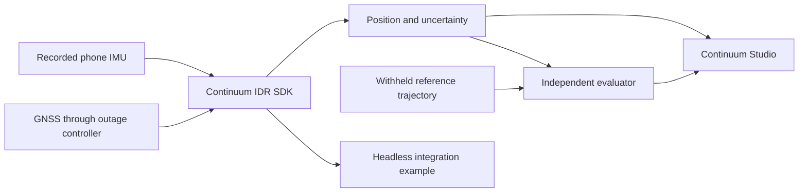

# Continuum IDR: product and prototype documentation

For the current implementation assessment and the staged path to an installable Android product, see the [product delivery plan](PRODUCT_DELIVERY_PLAN.md) (30 September 2026). It covers verified code gaps, mobile inference, real and synthetic data, navigation accuracy, cooperative traffic warnings, delivery milestones and acceptance evidence. The older design documents below remain useful background; their completion claims must be checked against this assessment and actual artifacts.

**Working product name:** Continuum IDR SDK. This is a proposed name, not a trademark or availability claim.

**Product idea:** an embeddable navigation engine that accepts timestamped IMU measurements and optional GNSS fixes, then produces continuous position, velocity, heading, uncertainty, and sensor-health information. A developer integrates the engine into a navigation app, vehicle device, or edge computer. Training and evaluation tools accompany the runtime.

**What to build and show first:** a real Python SDK, a trained small model, and a replay application called **Continuum Studio**. Studio plays a held-out IO-VNBD drive, withholds GNSS from the SDK, shows the estimated vehicle continuing through the outage, restores GNSS, and exports measured results. Show a short second integration using the same SDK without the dashboard. This makes the reusable engine visible as the product.

The prototype is one end-to-end release of the proposed product. The later Android app embeds the runtime locally; a laptop replay or a phone streaming to a laptop does not demonstrate on-phone inference.

## Current status

The **Continuum IDR project** is implemented and verified end-to-end:
- **Android Application**: Standalone Gradle project compiling to `android/app/build/outputs/apk/debug/app-debug.apk` (1.09 MB), packaging trained `motion_portable.json` weights, on-device dead reckoning, offline vector `MapView`, foreground trip recorder, and cooperative BLE V2V hazard beaconing.
- **Python Research SDK & Studio**: Core estimator, trained model (`models/motion_p0`), evaluation suite (`artifacts/evaluation/`), and Continuum Studio replay server.
- **Parity Testing**: Multi-stage deterministic fixture (`parity_fixture.json`) verified in both Kotlin JVM (`ParityTest.kt`) and Python (`test_parity.py`) within $10^{-4}$ m/s tolerance.
- **Deterministic Simulation**: 20-scenario synthetic generator (`continuum_idr/synthetic.py`) covering tunnels, speed bumps, potholes, motorcycle lean, parking crawl/reverse, multipath, and 200 Hz IMU.
- **Indian-Road Pipeline**: Ingestion and validation engine (`continuum_idr/phone_data.py`) and standard operating protocol (`docs/INDIAN_ROAD_COLLECTION_PROTOCOL.md`).
- **Cooperative Traffic Gateway**: Localized FastAPI clearinghouse (`continuum_idr/traffic_gateway.py`) with spatial clustering and confidence decay.

See [CURRENT_STATUS.md](CURRENT_STATUS.md) and [PROJECT_STATUS.md](PROJECT_STATUS.md) for canonical status and test matrices.

## Reading order

| Document | What it decides |
| --- | --- |
| [1. Product vision](docs/idr/01_PRODUCT_VISION.md) | Who uses the SDK, its value, differentiators, and product boundaries |
| [2. Requirements and release scope](docs/idr/02_REQUIREMENTS_AND_SCOPE.md) | Every problem-statement capability mapped to a release and evidence |
| [3. Architecture](docs/idr/03_ARCHITECTURE.md) | Data flow, estimator, alignment, learned corrections, maps, and deployment |
| [4. SDK specification](docs/idr/04_SDK_SPECIFICATION.md) | Public API, input/output contracts, lifecycle, errors, and packaging |
| [5. Data and model plan](docs/idr/05_DATA_AND_MODEL_PLAN.md) | Exact IO-VNBD preparation, labels, splits, models, and local collection |
| [6. Evaluation protocol](docs/idr/06_EVALUATION_PROTOCOL.md) | Honest GNSS masking, baselines, drift metrics, uncertainty, and timing |
| [7. Field collection protocol](docs/INDIAN_ROAD_COLLECTION_PROTOCOL.md) | Standardized Indian road data capture, vehicle classes, and reporting |
| [8. Android integration](android/README.md) | Android Gradle project, offline MapView, BLE V2V, and APK usage |
| [9. Runtime API](docs/RUNTIME_API.md) | Interactive backend streaming and playback control specification |
| [10. Results report](artifacts/evaluation/RESULTS.md) | Authoritative held-out IO-VNBD evaluation figures |

## The first prototype at a glance

The evaluator can see the reference route. The SDK cannot see withheld GNSS, future samples, or reference vehicle speed during the blackout.

**Video story:** “Here is a held-out drive. GNSS is now withheld. Our reusable SDK continues estimating motion from the phone IMU and its last accepted state. Here is the measured error against a reference the SDK cannot access. GNSS returns through the same estimator. The same package also works in another client.”

Start with a mounted-phone, forward-driving car profile. Extend to phone movement, road matching, Android, and external IMUs through the release plan. India-specific speed-breaker landmarks are a later measured experiment requiring independently collected reference landmarks.
