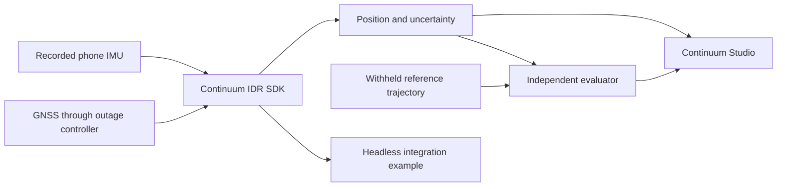

# Continuum IDR: product and prototype documentation

For the current implementation assessment and the staged path to an installable Android product, see the [product delivery plan](PRODUCT_DELIVERY_PLAN.md) (30 September 2026). It covers verified code gaps, mobile inference, real and synthetic data, navigation accuracy, cooperative traffic warnings, delivery milestones and acceptance evidence. The older design documents below remain useful background; their completion claims must be checked against this assessment and actual artifacts.

**Working product name:** Continuum IDR SDK. This is a proposed name, not a trademark or availability claim.

**Product idea:** an embeddable navigation engine that accepts timestamped IMU measurements and optional GNSS fixes, then produces continuous position, velocity, heading, uncertainty, and sensor-health information. A developer integrates the engine into a navigation app, vehicle device, or edge computer. Training and evaluation tools accompany the runtime.

**What to build and show first:** a real Python SDK, a trained small model, and a replay application called **Continuum Studio**. Studio plays a held-out IO-VNBD drive, withholds GNSS from the SDK, shows the estimated vehicle continuing through the outage, restores GNSS, and exports measured results. Show a short second integration using the same SDK without the dashboard. This makes the reusable engine visible as the product.

The prototype is one end-to-end release of the proposed product. The later Android app embeds the runtime locally; a laptop replay or a phone streaming to a laptop does not demonstrate on-phone inference.

## Current status

The **P0 prototype** is fully implemented and verified in this workspace. The engine, trained model (`models/motion_p0`), defensible evaluation suite (`artifacts/evaluation/`), and Continuum Studio replay dashboard are complete. See [PROJECT_STATUS.md](PROJECT_STATUS.md) for the active status report and [artifacts/evaluation/RESULTS.md](artifacts/evaluation/RESULTS.md) for the latest benchmark results. The design and architecture specifications below provide the technical foundation and roadmap.

## Reading order

| Document | What it decides |
| --- | --- |
| [1. Product vision](docs/idr/01_PRODUCT_VISION.md) | Who uses the SDK, its value, differentiators, and product boundaries |
| [2. Requirements and release scope](docs/idr/02_REQUIREMENTS_AND_SCOPE.md) | Every problem-statement capability mapped to a release and evidence |
| [3. Architecture](docs/idr/03_ARCHITECTURE.md) | Data flow, estimator, alignment, learned corrections, maps, and deployment |
| [4. SDK specification](docs/idr/04_SDK_SPECIFICATION.md) | Public API, input/output contracts, lifecycle, errors, and packaging |
| [5. Data and model plan](docs/idr/05_DATA_AND_MODEL_PLAN.md) | Exact IO-VNBD preparation, labels, splits, models, and local collection |
| [6. Evaluation protocol](docs/idr/06_EVALUATION_PROTOCOL.md) | Honest GNSS masking, baselines, drift metrics, uncertainty, and timing |
| [7. Prototype and video](docs/idr/07_PROTOTYPE_AND_VIDEO.md) | Screens, controls, demo sequence, narration, and recording checklist |
| [8. Roadmap and backlog](docs/idr/08_ROADMAP_AND_BACKLOG.md) | Build order, dependencies, work estimates, and completion gates |
| [9. Proposal and judge questions](docs/idr/09_PROPOSAL_AND_FAQ.md) | Reusable proposal wording and defensible answers |
| [10. Evidence and decisions](docs/idr/10_EVIDENCE_AND_DECISIONS.md) | Sources, corrections to the supplied advice, assumptions, and decisions |
| [Results template](docs/idr/templates/RESULTS_TEMPLATE.md) | The results table to populate after experiments |
| [Model card template](docs/idr/templates/MODEL_CARD_TEMPLATE.md) | Training provenance, limits, export, and runtime evidence |

## The first prototype at a glance

The evaluator can see the reference route. The SDK cannot see withheld GNSS, future samples, or reference vehicle speed during the blackout.

**Video story:** “Here is a held-out drive. GNSS is now withheld. Our reusable SDK continues estimating motion from the phone IMU and its last accepted state. Here is the measured error against a reference the SDK cannot access. GNSS returns through the same estimator. The same package also works in another client.”

Start with a mounted-phone, forward-driving car profile. Extend to phone movement, road matching, Android, and external IMUs through the release plan. India-specific speed-breaker landmarks are a later measured experiment requiring independently collected reference landmarks.
