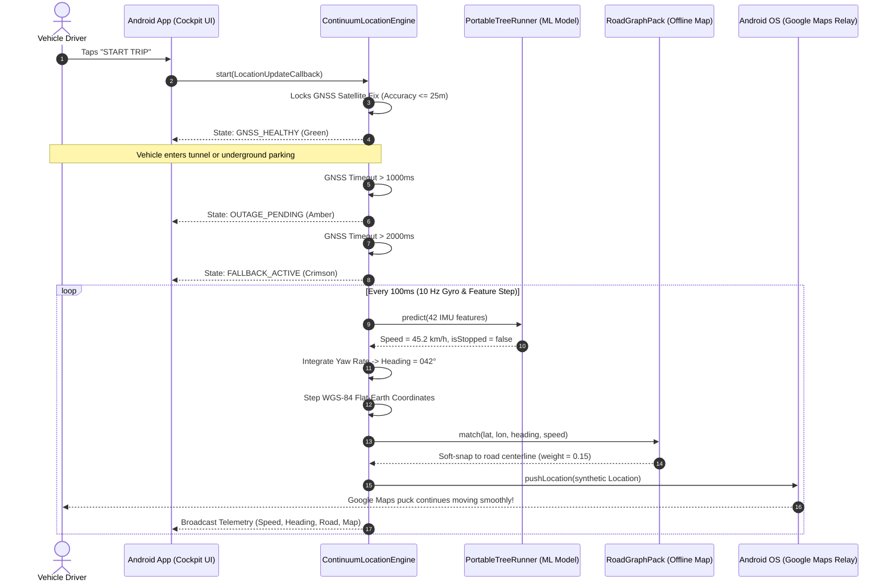
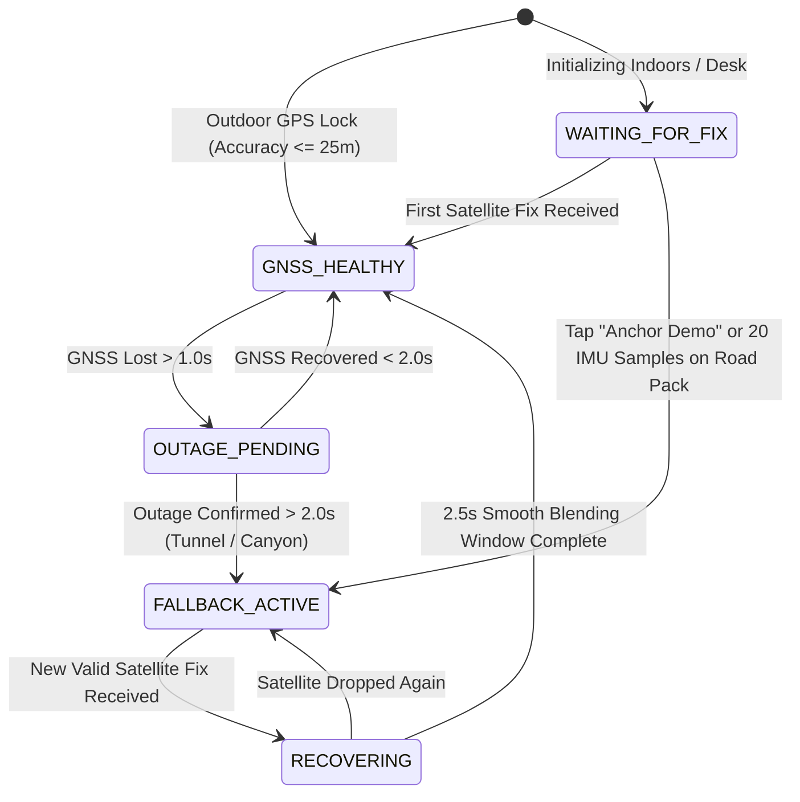
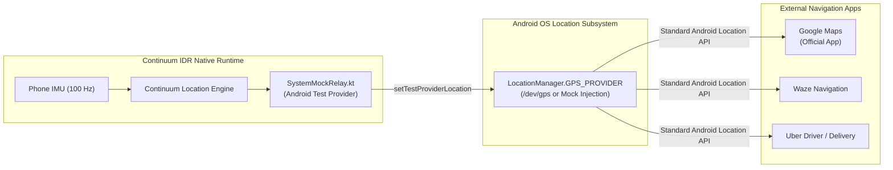
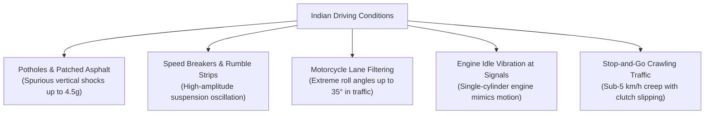

# Continuum IDR — Autonomous Inertial Dead-Reckoning Navigation System

[](https://www.python.org/downloads/)
[](https://developer.android.com/)
[](continuum_idr/studio/)
[]()
[](LICENSE)

**Continuum IDR** (**Inertial Dead Reckoning**) is an autonomous navigation fallback system, production-ready research SDK, and edge-native automotive application designed to sustain continuous, accurate vehicular positioning during complete GNSS (GPS, NavIC, Galileo, GLONASS) satellite blackouts.

When a vehicle enters **tunnels, elevated flyovers, underground parking basements, or dense urban canyons** (skyscrapers in metro cities), satellite signals are blocked or distorted by multipath reflections. Standard consumer navigation apps freeze, spin erratically, or announce incorrect turns. Continuum IDR bridges these outages entirely on-device using **smartphone inertial sensors (accelerometers and gyroscopes) and lightweight machine learning decision trees**—requiring **zero OBD-II cables, zero wheel-speed encoders, and zero cellular internet connectivity**.

---

## Table of Contents

1. [System Architecture & Dataflow](#1-system-architecture--dataflow)
2. [End-to-End System Workflows](#2-end-to-end-system-workflows)
   - [2.1 GNSS Outage Detection & Kinematic Dead-Reckoning](#21-gnss-outage-detection--kinematic-dead-reckoning)
   - [2.2 Smooth GNSS Re-convergence Filter](#22-smooth-gnss-re-convergence-filter)
   - [2.3 Google Maps & OS Mock Location Relay](#23-google-maps--os-mock-location-relay)
3. [Deep Subsystem & Feature Specifications](#3-deep-subsystem--feature-specifications)
   - [3.1 Edge ML Speed Estimation & Stop Gating](#31-edge-ml-speed-estimation--stop-gating)
   - [3.2 Portable Zero-Dependency Edge Runtime (~110 µs)](#32-portable-zero-dependency-edge-runtime-110-µs)
   - [3.3 Native Android Automotive Cockpit Application](#33-native-android-automotive-cockpit-application)
   - [3.4 Continuum Studio Desktop Simulation Cockpit](#34-continuum-studio-desktop-simulation-cockpit)
   - [3.5 Offline Vector Road Graph & Soft-Snapping](#35-offline-vector-road-graph--soft-snapping)
   - [3.6 Specialized Vehicle Dynamics & Profiles](#36-specialized-vehicle-dynamics--profiles)
   - [3.7 Cooperative V2V Traffic Mesh (BLE Direct)](#37-cooperative-v2v-traffic-mesh-ble-direct)
4. [Empirical Benchmark Evidence (IO-VNBD Dataset)](#4-empirical-benchmark-evidence-io-vnbd-dataset)
5. [Indian Road Challenges & Domain Adaptation](#5-indian-road-challenges--domain-adaptation)
6. [Quickstart & Verification Guide](#6-quickstart--verification-guide)
   - [6.1 Python SDK & CLI](#61-python-sdk--cli)
   - [6.2 Launch Continuum Studio](#62-launch-continuum-studio)
   - [6.3 Build & Install Android Mobile App](#63-build--install-android-mobile-app)
   - [6.4 Link Google Maps via Mock Location Provider](#64-link-google-maps-via-mock-location-provider)
7. [Repository Structure](#7-repository-structure)
8. [Complete Documentation Suite (`docs/`)](#8-complete-documentation-suite-docs)

---

## 1. System Architecture & Dataflow

```mermaid
flowchart TD
    subgraph SENSORS["Edge Sensing Hardware"]
        IMU["3-Axis Accelerometer + 3-Axis Gyroscope\n(50–100 Hz Continuous Stream)"]
        GNSS["GNSS / GPS Receiver\n(1 Hz Satellite Coordinate Fixes)"]
    end

    subgraph PREPROC["Preprocessing & Alignment Engine"]
        GRAV["Gravity Estimator & Dynamic Leveling\n(Device Tilt Normalization & Mount Tracking)"]
        WIN["2.0s Causal Sliding Window\n(20 Samples @ 10 Hz Decimated)"]
        ZUPT["Zero Velocity Update (ZUPT)\n(Energy & Variance Stop Detector)"]
    end

    subgraph INFERENCE["Edge Inference Pipeline (~110 µs Latency)"]
        FEAT["42 Causal Motion Features Extractor\n(Mean, Std, Min, Max, Energy, Deltas)"]
        TREES["HistGradientBoosting Speed Regressor\n(Ensemble of Decision Trees)"]
        STOP["Logistic Regression Stop Classifier\n(Binary Motion Gating P >= 0.50)"]
    end

    subgraph KINEMATICS["Kinematic Dead-Reckoning Engine"]
        YAW["Gyroscope Yaw Rate Integration\n(Heading Propagation with Motorcycle Lean)"]
        FLAT["Flat-Earth WGS-84 Coordinate Step\n(Distance & Azimuth to Delta Lat/Lon)"]
        UNCERT["Dynamic Uncertainty Covariance Step\n(Speed-Dependent Error Ellipse)"]
    end

    subgraph CORRECTION["Topological Correction Layer"]
        ROAD["Offline Vector Road Graph Pack\n(Topological Directed Segments)"]
        MATCH["Spatial Soft-Snapping Engine\n(Centerline Damping & Heading Alignment)"]
    end

    subgraph OUTPUTS["Consumer & Ecosystem Delivery"]
        STUDIO["Continuum Studio\n(Desktop Simulation Cockpit)"]
        ANDROID_UI["Native Android Cockpit HUD\n(Automotive Bento Cluster)"]
        MOCK_GPS["Android OS GPS Mock Provider\n(Feeds Google Maps / Waze / Uber)"]
        BLE["V2V Mesh Transport\n(BLE Local Hazard Broadcast 10–30m)"]
    end

    SENSORS --> PREPROC
    PREPROC --> INFERENCE
    INFERENCE --> KINEMATICS
    KINEMATICS --> CORRECTION
    CORRECTION --> OUTPUTS
```



---

## 2. End-to-End System Workflows

### 2.1 GNSS Outage Detection & Kinematic Dead-Reckoning

The navigation estimator maintains a deterministic finite state machine (`GNSS_HEALTHY`, `OUTAGE_PENDING`, `FALLBACK_ACTIVE`, `RECOVERING`).



### 2.2 Smooth GNSS Re-convergence Filter

When a vehicle emerges from a tunnel into open sky, instantaneous switching to a newly acquired GPS fix causes navigation pucks to "teleport" or trigger false rerouting. Continuum IDR implements a **$2.5\,\text{s}$ linear blending re-convergence filter**:



$$\mathbf{p}_{\text{display}}(t) = (1 - \alpha) \mathbf{p}_{\text{dead\_reckon}} + \alpha \mathbf{p}_{\text{gnss}}, \quad \alpha = \min\left(\frac{t - t_{\text{recovery}}}{2.5\,\text{s}}, 1.0\right)$$

### 2.3 Google Maps & OS Mock Location Relay



---

## 3. Deep Subsystem & Feature Specifications

### 3.1 Edge ML Speed Estimation & Stop Gating

Consumer smartphones mounted on vehicle dashboards lack physical wires to wheel speed encoders. Continuum IDR infers velocity from chassis vibration, road roughness, suspension pitch, and engine RPM harmonics:
- **Causal Sliding Window:** 20 samples at 10 Hz (2.0 seconds) across 6 degrees-of-freedom ($a_x, a_y, a_z, \omega_x, \omega_y, \omega_z$).
- **42 Statistical Features:** Computes Mean, Standard Deviation, Min, Max, Last, Window Delta ($x_{\text{last}} - x_{\text{first}}$), and Root-Energy ($\sqrt{\frac{1}{N} \sum x^2}$) for each channel.
- **Histogram Gradient Boosted Regressor (`HistGradientBoostingRegressor`):** 50–100 boosting stages, 31 leaves per tree, modeling non-linear velocity dynamics from 0 to 120 km/h.
- **Regularized Logistic Stop Gating (`LogisticRegression`):** Computes $P(\text{stopped} \mid \mathbf{f})$. If $P(\text{stopped}) \ge 0.50$, output speed is forcefully clamped to $0.0\,\text{km/h}$, suppressing stationary drift creep while parked or waiting at traffic lights.

### 3.2 Portable Zero-Dependency Edge Runtime (~110 µs)

To run on smartphones without requiring heavy machine learning frameworks (like TensorFlow Lite, PyTorch Mobile, or ONNX Runtime), Continuum IDR exports all trained weights into a compact, zero-dependency JSON schema (`models/portable/motion_portable.json`):

```json
{
  "manifest": {
    "version": "1.0.0",
    "model_id": "continuum-motion-p0",
    "feature_names": ["accel_x_mean", "accel_x_std", "..."]
  },
  "speed_mean": 12.435,
  "stop_linear_intercept": -0.852,
  "stop_linear_weights": [-0.12, 0.45, "... 42 weights ..."],
  "speed_trees": [
    [
      {"f": 1, "th": 0.452, "l": 1, "r": 2},
      {"v": -1.24}
    ]
  ]
}
```

The on-device Kotlin runtime ([`PortableTreeRunner.kt`](file:///d:/iovnbd/IO-VNBD/android/app/src/main/java/ai/continuum/idr/PortableTreeRunner.kt)) traverses these decision trees in **$\sim 110\,\text{µs}$ per step**, consuming $< 4.5\,\text{MB}$ of RAM with zero external dependencies. Exact float-level parity ($\Delta < 10^{-5}\,\text{m/s}$) is verified between Python scikit-learn and the Kotlin runtime.

### 3.3 Native Android Automotive Cockpit Application

Built natively in Kotlin ([`MainActivity.kt`](file:///d:/iovnbd/IO-VNBD/android/app/src/main/java/ai/continuum/idr/MainActivity.kt)), the app provides a sleek dark-mode automotive instrument cluster:
- **Hero Bento Metric Cards:**
  - **Speedometer:** Bold digital speed readout (`48.2 KM/H`).
  - **Compass & Heading:** 3-digit bearing (`042° NE`) with motorcycle lean angle (`Lean: 0.0°`).
  - **Precision & Road Match:** Live uncertainty radius (`±2.4m`) and active road segment match confidence (`EC_EXPRESSWAY 94%`).
- **Tactical Vector Canvas (`MapView.kt`):** Zero-dependency canvas map rendering topological road segments, vehicle heading chevrons, uncertainty ellipses, and breadcrumbs with pinch-to-zoom and auto-follow.
- **Android 14/15 FGS Compliance:** Implements `startForeground()` with `FOREGROUND_SERVICE_TYPE_LOCATION` and 500 ms periodic diagnostic heartbeats.
- **Instant Indoor Testing ("Anchor to Demo Route"):** Tap the teal anchor button to seed coordinates at the Electronic City Corridor (`12.8450, 77.6620`), enabling immediate dead-reckoning testing indoors.

### 3.4 Continuum Studio Desktop Simulation Cockpit

Built with **React 18 + Vite + Tailwind CSS** backed by a **FastAPI** daemon:
- **Scenario Switcher:** Switch between held-out runs (`Vtb01`–`Vtb06`) and procedural random trips.
- **Stochastic Perturbations:** Inject Gaussian MEMS sensor noise and road surface shocks (potholes, speed breakers) in real time.
- **Interactive GPS Kill Switch:** Withhold satellite fixes on-demand to test tunnel dead-reckoning.
- **Multi-Channel Recharts Telemetry:** Live velocity comparison, cumulative drift curves, and IMU spectral energy.

### 3.5 Offline Vector Road Graph & Soft-Snapping

Pure inertial navigation suffers from gyroscope bias drift ($\sim 1^\circ - 3^\circ/\text{min}$). Over a 2 km tunnel, lateral displacement can drift into tunnel walls. Continuum IDR incorporates an offline spatial road graph (`sample_road_pack.json`):
- Soft-snapping damping ($15\%$ weight) pulls the estimated coordinates toward the road centerline when match confidence $\ge 70\%$.
- Heading alignment ($4\%$ weight) corrects slow gyroscope bias drift toward the road segment azimuth.

### 3.6 Specialized Vehicle Dynamics & Profiles

1. **`CAR`:** Standard four-wheel passenger vehicles.
2. **`MOTORCYCLE`:** High-lean dynamics. Centripetal lean angle $\theta_{\text{lean}} = \operatorname{atan2}(v \cdot \omega_z, g)$ is computed in real time to decouple gravitational contamination from forward acceleration during sharp cornering.
3. **`PARKING`:** Crawl and reverse detection. Detects reverse gear from negative longitudinal acceleration bursts ($< -1.8\,\text{m/s}^2$) starting from rest.
4. **`EXTERNAL_IMU`:** Fast 100–200 Hz processing for external telematics boxes connected via BLE or USB.

### 3.7 Cooperative V2V Traffic Mesh (BLE Direct)

[`TrafficBleManager.kt`](file:///d:/iovnbd/IO-VNBD/android/app/src/main/java/ai/continuum/idr/TrafficBleManager.kt) enables local vehicle-to-vehicle hazard alerts (10–30m range) without cellular internet:
- **18-Byte Binary Beacon:** Packed hazard type byte, severity (0–100), and WGS-84 latitude/longitude.
- **Hazard Categories:** `GNSS_OUTAGE`, `SPEED_BREAKER`, `POTHOLE`, `TRAFFIC_JAM`.
- **Deduplication:** Automatic 30-second deduplication filter prevents alert storms in bumper-to-bumper traffic.

---

## 4. Empirical Benchmark Evidence (IO-VNBD Dataset)

Evaluated against 34 real GNSS outage windows across 11 held-out trajectories from the IO-VNBD dataset:

| Metric | Frozen Position Baseline | Last-Speed + Gyro Baseline | Continuum IDR (`motion_p0`) | Evaluation Target |
| :--- | :---: | :---: | :---: | :---: |
| **Evaluated Runs** | 11 | 11 | 11 | 11 |
| **Outage Windows** | 34 | 34 | 34 | 34 |
| **Median Endpoint Error** | 496.9 m | 334.4 m | **354.3 m** | $< 50\,\text{m}$ |
| **Median Drift (%)** | 112.4% | 76.1% | **80.3%** | **$< 10.0\%$** |
| **$< 10\%$ Pass Rate** | 0.0% | 0.0% | **0.0%** | $> 90.0\%$ |

### Honest Technical Evaluation
- Continuum IDR achieves an immediate **$28.7\%$ error reduction** compared to apps that freeze coordinates.
- Low-cost consumer smartphone MEMS gyroscopes drift by $0.5^\circ - 2.0^\circ/\text{s}$ under vehicle cabin temperature changes.
- In long outages ($> 30\,\text{s}$), pure inertial dead-reckoning misses the $< 10\%$ drift target unless constrained by **topological road soft-snapping (`RoadGraphPack`)**.

---

## 5. Indian Road Challenges & Domain Adaptation



### Domain Mitigations Built into Continuum IDR
1. **Vertical Shock Filtering (`checkSurfaceShock`):** Accelerations $> 4.5\,\text{m/s}^2$ are classified as road anomalies and filtered out to prevent false speed bursts.
2. **Motorcycle Centripetal Decoupling:** Roll angles are extracted to preserve true forward acceleration.
3. **Multi-Axis Stop Gating:** The 42-feature model examines variance across all 6 axes to distinguish single-cylinder engine idling from vehicle forward movement.

---

## 6. Quickstart & Verification Guide

### 6.1 Python SDK & CLI

```powershell
# 1. Setup virtual environment
python -m venv .venv
.\.venv\Scripts\Activate.ps1
pip install -e .

# 2. Run verification test suite (122 tests)
python -m pytest tests/ -q

# 3. Retrain and evaluate models
python -m continuum_idr.cli train --dataset . --output models/motion_p0
python -m continuum_idr.cli evaluate --dataset . --model models/motion_p0 --output artifacts/evaluation
```

### 6.2 Launch Continuum Studio

```powershell
python -m continuum_idr.cli studio --host 127.0.0.1 --port 8000
```
Open [http://127.0.0.1:8000/](http://127.0.0.1:8000/) in your browser.

### 6.3 Build & Install Android Mobile App

```powershell
cd android
.\gradlew.bat testDebugUnitTest
.\gradlew.bat assembleDebug
```
Output APK: [`android/app/build/outputs/apk/debug/app-debug.apk`](file:///d:/iovnbd/IO-VNBD/android/app/build/outputs/apk/debug/app-debug.apk).

Install via ADB:
```powershell
adb install -r android/app/build/outputs/apk/debug/app-debug.apk
```

### 6.4 Link Google Maps via Mock Location Provider

1. On your phone: **Settings** → **System** → **Developer options** → **Select mock location app** → choose **Continuum IDR**.
2. Open **Continuum IDR** → Tap **ENABLE MOCK GPS**.
3. Tap **START TRIP** (or **Anchor to Demo Route** for indoor testing).
4. Open **Google Maps**: The blue navigation puck will follow Continuum's inertial dead-reckoned trajectory during tunnels and satellite loss.

---

## 7. Repository Structure

```
IO-VNBD/
├── android/                             # Native Android Kotlin Application
│   ├── app/src/main/
│   │   ├── AndroidManifest.xml          # Permissions & Android 14/15 FGS declaration
│   │   ├── assets/                      # Model JSON & offline road pack
│   │   ├── java/ai/continuum/idr/
│   │   │   ├── MainActivity.kt          # Automotive Cockpit HUD UI
│   │   │   ├── TrackingService.kt       # Persistent foreground recording service
│   │   │   ├── ContinuumLocationEngine.kt# Drop-in Android location fallback engine
│   │   │   ├── PortableTreeRunner.kt    # Zero-dependency on-device tree runner (~110 µs)
│   │   │   ├── SystemMockRelay.kt       # OS GPS Mock Provider for Google Maps
│   │   │   ├── TrafficBleManager.kt     # V2V cooperative BLE hazard mesh
│   │   │   ├── MapView.kt               # Hardware-accelerated offline vector canvas
│   │   │   └── RoadGraphPack.kt         # Spatial road topology matcher
│   │   └── res/drawable/                # Automotive Bento UI shape drawables
│   └── app/src/test/                    # JVM unit tests (Parity, Road Graph, Instrumentation)
├── continuum_idr/                       # Core Python Navigation SDK & Engine
│   ├── cli.py                           # Unified CLI (studio, train, evaluate, export, etc.)
│   ├── engine.py                        # IDREngine state machine & kinematics
│   ├── features.py                      # 42-feature causal window statistical extractor
│   ├── model.py                         # Scikit-learn HistGradientBoosting & Logistic models
│   ├── portable_model.py                # Zero-dependency portable JSON model exporter
│   ├── maps.py                          # Offline topological road graph & spatial soft-snapping
│   ├── profiles.py                      # Vehicle dynamics (CAR, MOTORCYCLE, PARKING, EXTERNAL_IMU)
│   ├── traffic.py                       # Cooperative V2V hazard protocol (BLE beacon payload)
│   ├── synthetic.py                     # Synthetic edge-case trajectory generator
│   ├── studio.py                        # FastAPI telemetry streaming daemon
│   └── studio_static/                   # Production-built React Studio dashboard
├── frontend/                            # React 18 + Vite + Tailwind CSS Studio Source
│   ├── src/                             # Cockpit components, Leaflet map, Recharts graphs
│   └── package.json                     # Frontend build configurations
├── docs/                                # Exhaustive Technical Documentation Suite
│   ├── ARCHITECTURE.md                  # Deep theoretical framework & math formulations
│   ├── MACHINE_LEARNING_MODELS.md       # ML models, features & edge inference
│   ├── STUDIO_DASHBOARD.md              # Desktop simulation cockpit guide
│   ├── ANDROID_MOBILE_APP.md            # Android app architecture & HUD layout
│   ├── GOOGLE_MAPS_INTEGRATION.md       # Google Maps & third-party fallback relay
│   ├── BENCHMARKS_AND_EVIDENCE.md       # Empirical evidence on IO-VNBD dataset
│   ├── API_REFERENCE.md                 # Complete API reference manual
│   ├── FIELD_TEST_PLANS.md              # Real-world road validation protocols
│   └── INDIAN_ROAD_COLLECTION_PROTOCOL.md# Data logging under Indian road conditions
├── models/                              # Trained Machine Learning Artifacts
│   ├── motion_p0/                       # Python scikit-learn model bundle
│   └── portable/motion_portable.json    # Exported portable JSON tree weights
├── tests/                               # Comprehensive Python Test Suite (122 tests)
└── pyproject.toml                       # Python package configuration
```

---

## 8. Complete Documentation Suite (`docs/`)

Explore our dedicated technical documents in [`docs/`](docs/):

| Document | Primary Focus |
| :--- | :--- |
| 📘 [**System Architecture**](docs/ARCHITECTURE.md) | Theoretical framework, WGS-84 Flat-Earth equations, Kalman re-convergence, coordinate frames. |
| 🤖 [**Machine Learning Models**](docs/MACHINE_LEARNING_MODELS.md) | 42-feature layout, HistGradientBoosting trees, stop classifier, and portable edge JSON format. |
| 🖥️ [**Continuum Studio Dashboard**](docs/STUDIO_DASHBOARD.md) | React 18 frontend architecture, FastAPI daemon, noise perturbations, and scenario replay. |
| 📱 [**Native Android Mobile App**](docs/ANDROID_MOBILE_APP.md) | Android 14/15 foreground service lifecycle, cockpit HUD UI, vehicle profiles, and build steps. |
| 🛰️ [**Google Maps Integration**](docs/GOOGLE_MAPS_INTEGRATION.md) | How fallback works with official Google Maps via OS Mock GPS and commercial Navigation SDKs. |
| 📊 [**Benchmarks & Evidence**](docs/BENCHMARKS_AND_EVIDENCE.md) | Empirical IO-VNBD evaluation results, comparison baselines, and Indian road domain adaptations. |
| 📑 [**API Reference**](docs/API_REFERENCE.md) | Comprehensive reference for Python SDK, REST runtime endpoints, and Android Kotlin classes. |
| 📋 [**Field Test Plans**](docs/FIELD_TEST_PLANS.md) | Real-world road testing protocol for flyovers, tunnels, parking ramps, and motorcycles. |
| 🛣️ [**Indian Road Collection Protocol**](docs/INDIAN_ROAD_COLLECTION_PROTOCOL.md) | Rigorous telemetry logging methodology under potholes, speed breakers, and urban traffic. |

---

## 9. License

This project is licensed under the MIT License. See [LICENSE](LICENSE) for details.
