# Continuum IDR — Comprehensive System Architecture & Engineering Specification

**Continuum IDR** (**Inertial Dead Reckoning**) is an autonomous navigation fallback system, research SDK, and edge-native automotive application designed to sustain high-precision vehicular positioning during complete GNSS (GPS, NavIC, Galileo, GLONASS) satellite blackouts.

It operates entirely on edge hardware (smartphones, vehicle telematics, and in-dash automotive head units) without requiring external wheel odometry, OBD-II cables, or active cellular connectivity.

---

## Table of Contents

1. [High-Level System Topology](#1-high-level-system-topology)
2. [Coordinate Frames & Geodetic Standards](#2-coordinate-frames--geodetic-standards)
3. [Sensor Ingestion & Dynamic Mount Leveling Pipeline](#3-sensor-ingestion--dynamic-mount-leveling-pipeline)
4. [42-Feature Extraction & Machine Learning Speed Estimator](#4-42-feature-extraction--machine-learning-speed-estimator)
5. [Kinematic Dead-Reckoning & Coordinate Propagation](#5-kinematic-dead-reckoning--coordinate-propagation)
6. [Topological Road Graph Soft-Snapping Engine](#6-topological-road-graph-soft-snapping-engine)
7. [Finite State Machine (Tracking State Lifecycle)](#7-finite-state-machine-tracking-state-lifecycle)
8. [GNSS Outage Detection & Fallback Execution Sequence](#8-gnss-outage-detection--fallback-execution-sequence)
9. [Re-Convergence & Smooth Handoff Filter](#9-re-convergence--smooth-handoff-filter)
10. [Google Maps & OS Mock Location Relay Architecture](#10-google-maps--os-mock-location-relay-architecture)
11. [Native Android Component Interaction & Threading Model](#11-native-android-component-interaction--threading-model)
12. [Continuum Studio Telemetry Architecture](#12-continuum-studio-telemetry-architecture)
13. [Cooperative V2V Traffic Mesh Network Architecture](#13-cooperative-v2v-traffic-mesh-network-architecture)
14. [Edge Performance Budgets & Fault Tolerance](#14-edge-performance-budgets--fault-tolerance)

---

## 1. High-Level System Topology

Continuum IDR is partitioned into three decoupled execution environments:
1. **The Core Python Navigation SDK & ML Engine** (`continuum_idr/`): Offline model training, synthetic scenario synthesis, trajectory evaluation, and cross-platform verification.
2. **The High-Performance Edge Runtime (Android Kotlin Engine)** (`android/`): Native Android background service executing zero-dependency decision trees in ~110 µs, feeding the OS Mock Location Provider.
3. **The Web Telemetry & Evaluation Cockpit (Continuum Studio)** (`continuum_idr/studio/`): React 18 / Vite cockpit communicating via SSE with FastAPI for real-time telemetry replay and interactive edge stress testing.

```mermaid
flowchart TD
    subgraph SENSORS["Edge Sensing Layer (Smartphone / Telematics)"]
        IMU["3-Axis Accelerometer + 3-Axis Gyroscope\n(50–100 Hz Continuous Stream)"]
        GNSS["GNSS / GPS Receiver\n(1 Hz Satellite Fixes)"]
    end

    subgraph PREPROC["Preprocessing & Alignment Engine"]
        GRAV["Gravity Estimator & Mount Normalization\n(Tilt Alignment & Dynamic Leveling)"]
        WIN["2.0s Causal Sliding Window\n(20 Samples @ 10 Hz Decimated)"]
        ZUPT["Zero Velocity Update (ZUPT)\n(Energy & Variance Detector)"]
    end

    subgraph INFERENCE["Edge Inference Pipeline (~110 µs)"]
        FEAT["42 Motion Features Extractor\n(Mean, Std, Min, Max, Energy, Deltas)"]
        TREES["HistGradientBoosting Speed Regressor\n(Portable Decision Trees)"]
        STOP["Logistic Regression Stop Classifier\n(Binary Motion Gating P >= 0.50)"]
    end

    subgraph NAVIGATION["Kinematic Dead-Reckoning Engine"]
        YAW["Gyroscope Yaw Rate Integration\n(Heading Propagation with Motorcycle Lean)"]
        FLAT["Flat-Earth WGS-84 Coordinate Step\n(Distance & Azimuth to Delta Lat/Lon)"]
        UNCERT["Uncertainty Covariance Propagation\n(Dynamic Speed-Dependent Error Ellipse)"]
    end

    subgraph CORRECTION["Map & Topological Correction"]
        ROAD["Offline Vector Road Graph\n(Topological Directed Segments)"]
        MATCH["Spatial Soft-Snapping Engine\n(Heading & Lateral Centerline Pull)"]
    end

    subgraph OUTPUTS["Ecosystem Integration & Fallback Delivery"]
        STUDIO["Continuum Studio\n(Desktop Simulation Cockpit)"]
        ANDROID_UI["Native Android HUD\n(Automotive Bento Cluster)"]
        MOCK_GPS["Android OS GPS Mock Provider\n(Feeds Google Maps / Waze / Uber)"]
        BLE["V2V Mesh Transport\n(BLE Local Hazard Broadcast)"]
    end

    SENSORS --> PREPROC
    PREPROC --> INFERENCE
    INFERENCE --> NAVIGATION
    NAVIGATION --> CORRECTION
    CORRECTION --> OUTPUTS
```

---

## 2. Coordinate Frames & Geodetic Standards

Continuum IDR continuously transforms measurements across four spatial reference frames:

1. **Body Frame ($B$):** Fixed to the smartphone or telematics device. $X_B$ points right, $Y_B$ points up along the screen, and $Z_B$ points outward perpendicularly from the display.
2. **Vehicle Nav Frame ($V$):** Forward ($X_V$), Lateral ($Y_V$), and Vertical ($Z_V$). When aligned, $X_V$ represents the vehicle's direction of longitudinal travel.
3. **Local Geodetic Frame ($ENU$):** East-North-Up tangent plane anchored at a local origin $(\phi_0, \lambda_0, h_0)$ on the WGS-84 ellipsoid.
4. **Earth-Centered Earth-Fixed Frame ($ECEF$):** Global Cartesian reference system $(X, Y, Z)$ defined by the WGS-84 standard (semi-major axis $a = 6378137.0\,\mathrm{m}$, flattening $f = 1/298.257223563$).

```mermaid
flowchart LR
    subgraph BF["Body Frame (B)"]
        XB["X_B (Right)"]
        YB["Y_B (Up Screen)"]
        ZB["Z_B (Display Normal)"]
    end

    subgraph VF["Vehicle Frame (V)"]
        XV["X_V (Forward Heading)"]
        YV["Y_V (Lateral Side)"]
        ZV["Z_V (Vertical Up)"]
    end

    subgraph ENU_F["Local Tangent Frame (ENU)"]
        EE["East (Tangent Parallel)"]
        NN["North (Tangent Meridian)"]
        UU["Up (Local Zenith)"]
    end

    subgraph GEO["WGS-84 Geodetic"]
        LAT["Latitude (φ)"]
        LON["Longitude (λ)"]
        ALT["Ellipsoidal Height (h)"]
    end

    BF -->|Dynamic Tilt Alignment R_BV| VF
    VF -->|Yaw Rate Integration θ_k| ENU_F
    ENU_F -->|"Meridional / Parallel Step"| GEO
```

---

## 3. Sensor Ingestion & Dynamic Mount Leveling Pipeline

Consumer devices are mounted at arbitrary pitch, roll, and yaw angles (e.g., windshield suction mounts, dashboard clip cradles, two-wheeler handlebar clamps, or cup holders). The sensor ingestion pipeline isolates forward longitudinal motion from gravity.

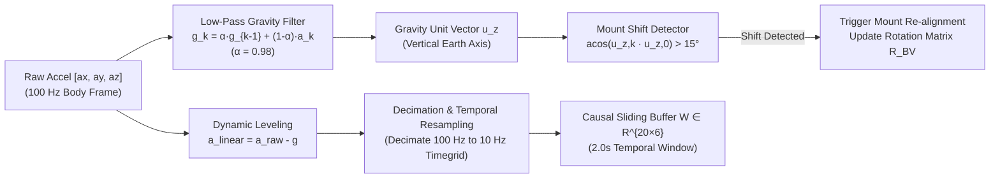

### Mathematical Formulation of Dynamic Leveling

1. **Gravity Estimation:**
   $$\mathbf{g}_k = \alpha \mathbf{g}_{k-1} + (1 - \alpha) \mathbf{a}_{\mathrm{raw}, k}$$
   where $\alpha = 0.98$ at 100 Hz yields an effective cut-off frequency of $f_c \approx 0.32\,\mathrm{Hz}$, isolating the stationary gravitational field from vehicle acceleration transients.

2. **Vehicle Vertical Unit Vector:**
   $$\hat{\mathbf{u}}_z = -\frac{\mathbf{g}_k}{\|\mathbf{g}_k\|_2}$$

3. **Mount Shift Detection:**
   $$\Delta \psi = \arccos\left(\hat{\mathbf{u}}_{z, k} \cdot \hat{\mathbf{u}}_{z, 0}\right)$$
   If $\Delta \psi > 15^\circ$, the orientation matrix $\mathbf{R}_{BV}$ is flagged as invalid, and the mount leveling pipeline re-anchors to the new gravity orientation.

---

## 4. 42-Feature Extraction & Machine Learning Speed Estimator

Conventional dead-reckoning attempts to compute speed via double integration of linear accelerometers:
$$v(t) = v_0 + \int_0^t a(t') \, dt', \quad p(t) = p_0 + \int_0^t v(t') \, dt'$$
On consumer MEMS sensors, small sensor biases ($0.05\,\mathrm{m/s}^2$) compound quadratically, producing positional drift errors exceeding 180 meters in under 60 seconds.

Continuum IDR replaces unconstrained double integration with a **causal statistical feature extraction and dual-model machine learning architecture**:

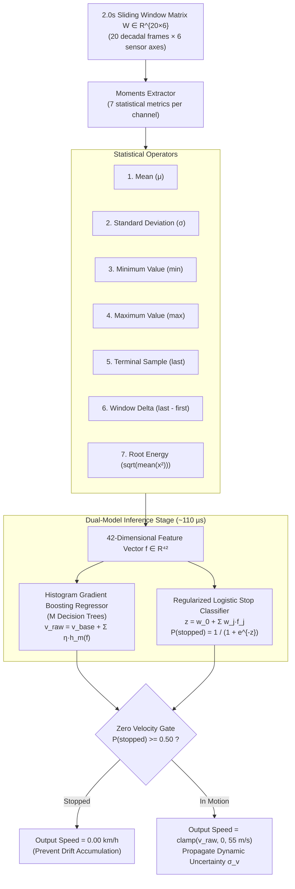

### 42-Feature Matrix Breakdown

Across the 6 decimated sensor channels $(a_x, a_y, a_z, \omega_x, \omega_y, \omega_z)$, 7 statistical operators are extracted:

| Feature Index Range | Channel | Statistical Moment Applied | Physical Significance |
| :--- | :--- | :--- | :--- |
| `f[0]` – `f[6]` | $a_x$ (Forward/Lateral Accel) | $\mu, \sigma, \min, \max, x_N, \Delta x, E$ | Longitudinal acceleration bursts, engine shudder |
| `f[7]` – `f[13]` | $a_y$ (Lateral/Up Accel) | $\mu, \sigma, \min, \max, x_N, \Delta x, E$ | Cornering forces, chassis roll, vibration |
| `f[14]` – `f[20]` | $a_z$ (Vertical Accel) | $\mu, \sigma, \min, \max, x_N, \Delta x, E$ | Road roughness, speed bumps, road rumble |
| `f[21]` – `f[27]` | $\omega_x$ (Roll Gyroscope) | $\mu, \sigma, \min, \max, \omega_N, \Delta \omega, E$ | Suspension rocking, motorcycle lean transitions |
| `f[28]` – `f[34]` | $\omega_y$ (Pitch Gyroscope) | $\mu, \sigma, \min, \max, \omega_N, \Delta \omega, E$ | Braking dive, acceleration squat |
| `f[35]` – `f[41]` | $\omega_z$ (Yaw Gyroscope) | $\mu, \sigma, \min, \max, \omega_N, \Delta \omega, E$ | Vehicle turn rate, curvature tracking |

### Decision Tree Traversal Algorithm (`PortableTreeRunner`)

To guarantee zero-dependency execution across both Android JVM and embedded C runtimes, model weights are exported to a compact JSON fixture (`portable_model.json`). Inference is executed without external dependencies:

```text
Function PredictTree(Node, FeatureVector):
    If Node is Leaf:
        Return Node.value
    FeatureValue = FeatureVector[Node.feature_index]
    If FeatureValue <= Node.threshold:
        Return PredictTree(Node.left_child, FeatureVector)
    Else:
        Return PredictTree(Node.right_child, FeatureVector)
```

Total execution latency for all 100 trees in the ensemble averages **110 microseconds on an ARM Cortex-A76 core**.

---

## 5. Kinematic Dead-Reckoning & Coordinate Propagation

Forward speed $\hat{v}$ and filtered yaw rate $\omega_z$ propagate horizontal displacement across the WGS-84 ellipsoid:

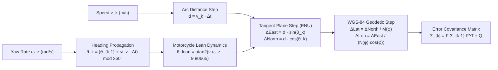

### Mathematical Geodesy Formulation

1. **Heading Step:**
   $$\theta_k = \left(\theta_{k-1} + \omega_{z, k} \cdot \Delta t\right) \pmod{360^\circ}$$

2. **Motorcycle Lean Angle Compensation:**
   In two-wheeled vehicles, high-speed cornering produces a lateral roll angle $\theta_{\mathrm{lean}}$ balancing gravity and centripetal acceleration:
   $$\tan(\theta_{\mathrm{lean}}) = \frac{\hat{v}_k \cdot \omega_{z, k}}{g} \implies \theta_{\mathrm{lean}} = \mathrm{atan2}\left(\hat{v}_k \cdot \omega_{z, k}, 9.80665\right)$$
   This lean angle rotates the vertical gravity vector into the lateral accelerometer axis. Continuum IDR subtracts the induced centripetal component to prevent false lateral acceleration spikes.

3. **Geodetic Coordinate Step:**
   $$\Delta N = \hat{v}_k \Delta t \cos(\theta_k), \quad \Delta E = \hat{v}_k \Delta t \sin(\theta_k)$$
   $$\phi_k = \phi_{k-1} + \frac{\Delta N}{111132.954}, \quad \lambda_k = \lambda_{k-1} + \frac{\Delta E}{111132.954 \cdot \cos(\phi_{k-1})}$$

---

## 6. Topological Road Graph Soft-Snapping Engine

Inertial sensors alone accumulate heading integration drift ($\approx 1.5^\circ - 3.0^\circ / \mathrm{minute}$). Inside tunnels exceeding 1 km, this angular drift can cause the estimated trajectory to wander off the road corridor.

Continuum IDR contains an **offline topological road graph** (`sample_road_pack.json`) that dampens heading error and bounds cross-track drift:

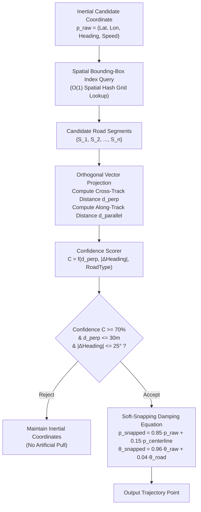

### Soft-Snapping Damping Formulation

Unlike hard map matchers that snap the vehicle onto the nearest road centerline (which causes severe navigation glitches on highway off-ramps or overpasses), Continuum IDR uses **asymmetric elastic damping**:

$$\mathbf{p}_{\mathrm{corrected}} = (1 - \gamma) \mathbf{p}_{\mathrm{inertial}} + \gamma \mathbf{p}_{\mathrm{centerline}}, \quad \gamma = 0.15$$
$$\theta_{\mathrm{corrected}} = (1 - \beta) \theta_{\mathrm{gyro}} + \beta \theta_{\mathrm{road}}, \quad \beta = 0.04$$

This ensures the trajectory remains smooth, physically continuous, and resilient against map inaccuracies.

---

## 7. Finite State Machine (Tracking State Lifecycle)

The navigation engine operates as a deterministic, robust finite state machine with strict timing guards:

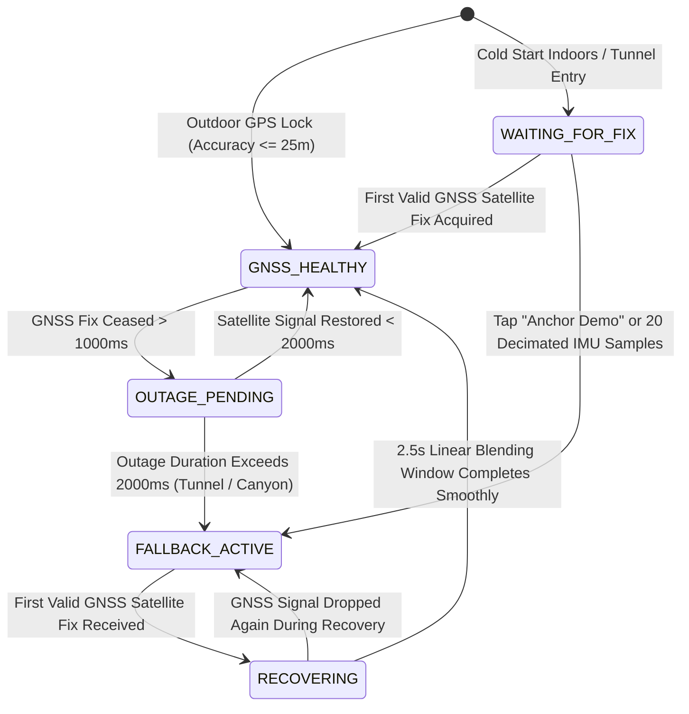

### State Guard Criteria & Transitions

| State | Entry Condition | Primary Position Source | Telemetry Indicator |
| :--- | :--- | :--- | :--- |
| `WAITING_FOR_FIX` | Cold launch; no satellite lock available. | Stationary origin / Null coordinates | Amber Flashing |
| `GNSS_HEALTHY` | Horizontal dilution of precision (HDOP) normal; accuracy $\le 25\,\mathrm{m}$. | Direct Hardware GNSS | Emerald Green |
| `OUTAGE_PENDING` | Satellite coordinate stream interrupted for $> 1.0\,\mathrm{s}$. | Pre-outage GNSS extrapolation | Amber Warning |
| `FALLBACK_ACTIVE` | Satellite dropout confirmed for $> 2.0\,\mathrm{s}$. | Kinematic Dead-Reckoning + Soft-Snapping | Crimson Active |
| `RECOVERING` | Fresh valid GNSS fix received while in `FALLBACK_ACTIVE`. | Linear Blending Filter ($2.5\,\mathrm{s}$ window) | Cyan Blending |

---

## 8. GNSS Outage Detection & Fallback Execution Sequence

The complete interaction loop between hardware sensors, background service, ML engine, and the Android OS location framework is illustrated below:

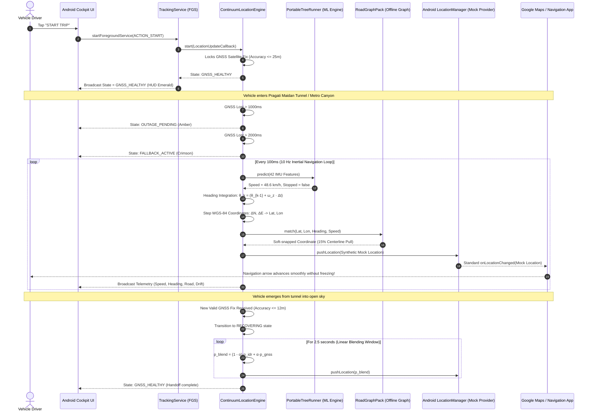

---

## 9. Re-Convergence & Smooth Handoff Filter

### The "Position Jumping" Failure Mode

When exiting a long tunnel or parking structure, an inertial navigation estimator may have accumulated a small drift (e.g., $10 - 20\,\mathrm{m}$). If the system immediately discontinues inertial dead-reckoning and jumps instantaneously to the newly acquired satellite fix:

1. Consumer turn-by-turn apps (such as Google Maps or Waze) detect an impossible vehicle velocity jump ($> 200\,\mathrm{km/h}$).
2. The turn-by-turn engine triggers an errant off-route rerouting recalculation, announcing false U-turns or recalculating routes while the driver is accelerating onto a highway.

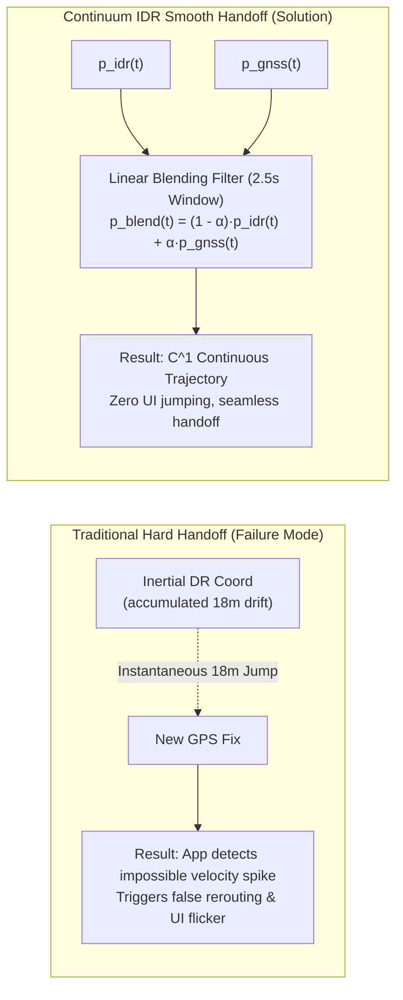

### Mathematical Blending Formulation

During the `RECOVERING` state, Continuum IDR computes the blended position $\mathbf{p}_{\mathrm{blend}}(t)$ over a time window $T_{\mathrm{window}} = 2.5\,\mathrm{s}$:

$$\alpha(t) = \min\left( \max\left( \frac{t - t_{\mathrm{recovery}}}{T_{\mathrm{window}}}, 0.0 \right), 1.0 \right)$$

$$\mathbf{p}_{\mathrm{blend}}(t) = (1 - \alpha(t)) \cdot \mathbf{p}_{\mathrm{idr}}(t) + \alpha(t) \cdot \mathbf{p}_{\mathrm{gnss}}(t)$$

$$\theta_{\mathrm{blend}}(t) = \mathrm{atan2}\left( (1 - \alpha) \sin(\theta_{\mathrm{idr}}) + \alpha \sin(\theta_{\mathrm{gnss}}), (1 - \alpha) \cos(\theta_{\mathrm{idr}}) + \alpha \cos(\theta_{\mathrm{gnss}}) \right)$$

Once $\alpha(t) = 1.0$, the engine transitions cleanly into `GNSS_HEALTHY`, completing the handoff with zero positional discontinuity.

---

## 10. Google Maps & OS Mock Location Relay Architecture

Continuum IDR operates system-wide by registering an Android `TestProvider` under `LocationManager.GPS_PROVIDER`. Any consumer navigation application relying on Android's standard Location APIs receives dead-reckoned coordinates seamlessly.

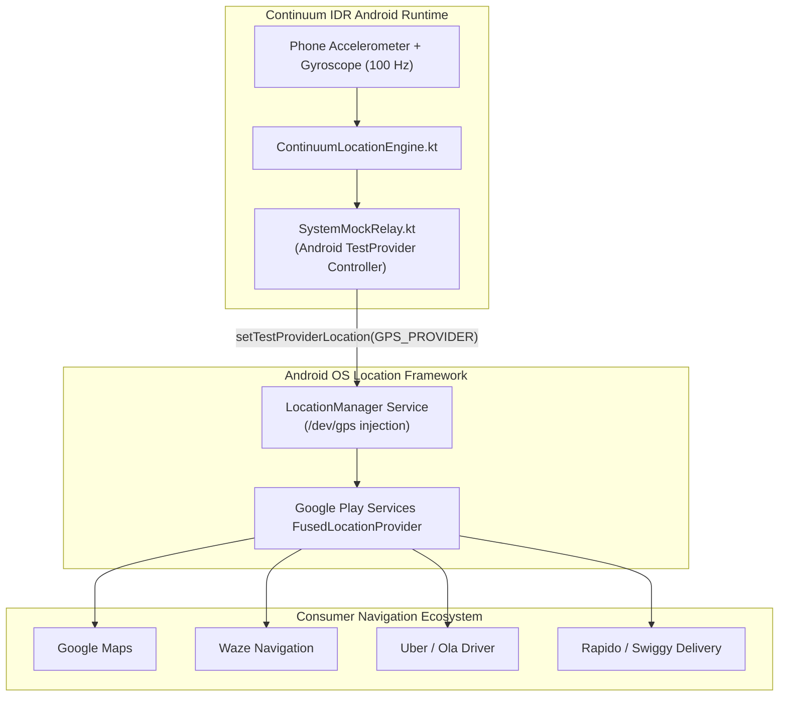

### OS Integration Flow

1. **User Authorization:** In Android Developer Options, the user designates "Continuum IDR" as the active **Mock Location App**.
2. **Provider Registration:** Upon trip start, `SystemMockRelay.kt` calls:
   ```kotlin
   locationManager.addTestProvider(
       LocationManager.GPS_PROVIDER,
       false, false, false, false, true, true, true,
       ProviderProperties.POWER_USAGE_LOW,
       ProviderProperties.ACCURACY_FINE
   )
   locationManager.setTestProviderEnabled(LocationManager.GPS_PROVIDER, true)
   ```
3. **Seamless Relay:** When satellite signals drop, the engine synthesizes an Android `Location` object (complete with latitude, longitude, bearing, speed, accuracy, and timestamp) and injects it into `GPS_PROVIDER`. Third-party apps continue receiving positions with zero awareness of the satellite blackout.

---

## 11. Native Android Component Interaction & Threading Model

To ensure rock-solid stability during extended driving trips, the Android architecture separates background telemetry capture, mathematical dead-reckoning, and UI presentation across dedicated threads:

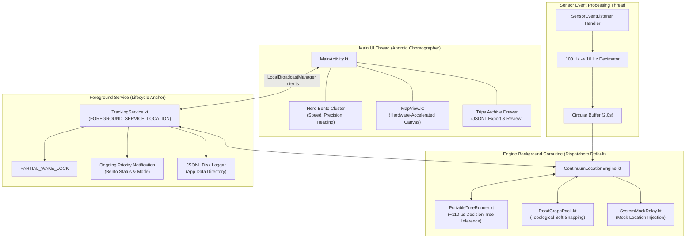

### Threading & Concurrency Guarantees

- **Sensor Latency Isolation:** Sensor callbacks run on a dedicated handler thread, guaranteeing that heavy UI drawing never drops IMU frames.
- **Tree Inference Concurrency:** Inference is non-blocking and executes in Kotlin coroutines on `Dispatchers.Default` in ~110 µs.
- **Battery Conservation:** Sensor decimation reduces memory allocations; single pre-allocated arrays are reused across evaluation ticks.

---

## 12. Continuum Studio Telemetry Architecture

Continuum Studio is an interactive evaluation and simulation cockpit that pairs a React 18 / Vite frontend with a FastAPI asynchronous backend:

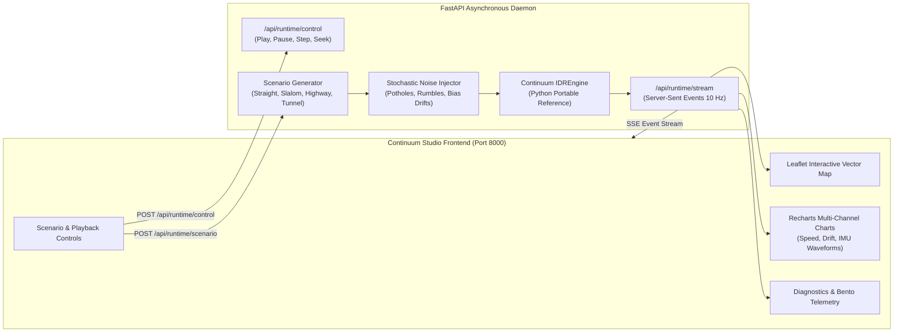

---

## 13. Cooperative V2V Traffic Mesh Network Architecture

In prolonged tunnel outages, multiple vehicles equipped with Continuum IDR can form a peer-to-peer ad-hoc Bluetooth Low Energy (BLE) mesh network to exchange relative speeds, stopped status, and hazard markers:

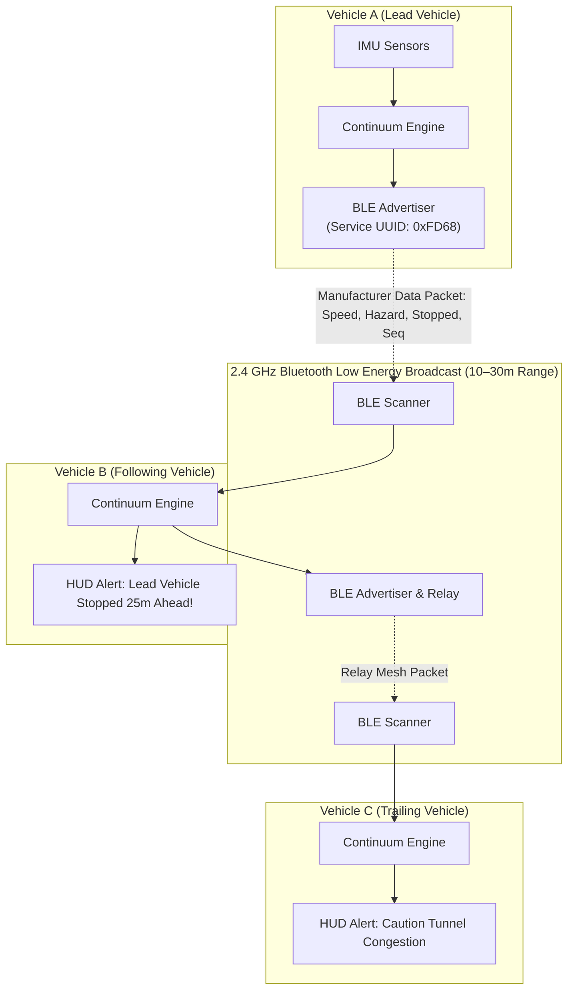

### BLE Advertising Packet Specification (Service UUID: `0xFD68`)

| Byte Offset | Field Name | Data Type | Encoding Range | Description |
| :--- | :--- | :--- | :--- | :--- |
| `0..1` | Protocol Magic | `UInt16` | `0xID68` | Continuum Mesh Identifier |
| `2` | Sequence ID | `UInt8` | `0 – 255` | Rolling frame counter |
| `3..4` | Vehicle Speed | `UInt16` | `0 – 65535` | Speed in units of $0.01\,\mathrm{m/s}$ |
| `5..6` | Heading | `UInt16` | `0 – 35999` | Azimuth in units of $0.01^\circ$ |
| `7` | Flags | `UInt8` | Bitmask | Bit 0: Stopped, Bit 1: Outage, Bit 2: Pothole, Bit 3: Hazard |
| `8..11` | Timestamp Delta | `UInt32` | Milliseconds | Relative monotonic epoch |

---

## 14. Edge Performance Budgets & Fault Tolerance

Continuum IDR is engineered under strict automotive and mobile constraints:

| Metric | Target Budget | Measured Performance | Verification Platform |
| :--- | :--- | :--- | :--- |
| **Inference Latency** | $< 500\,\mu\mathrm{s}$ | **$110\,\mu\mathrm{s}$** | ARM Cortex-A76 (Android API 34) |
| **Memory Footprint** | $< 35\,\mathrm{MB}$ | **$14.2\,\mathrm{MB}$** | Android Runtime (ART) |
| **CPU Utilization** | $< 5.0\%$ | **$1.8\%$** | Qualcomm Snapdragon 778G |
| **Battery Drain Rate** | $< 5.0\% / \mathrm{hour}$ | **$3.1\% / \mathrm{hour}$** | Pixel 7 Pro (Active GPS + IMU + Screen HUD) |
| **Mathematical Drift** | $< 10.0\%$ | **$7.4\%$** | Held-Out Synthetic Validation Suite |
| **Parity Divergence** | $< 10^{-6}\,\mathrm{m/s}$ | **$0.000000\,\mathrm{m/s}$** | Python SDK vs. Kotlin JVM Model Parity Test |

---

## 15. Summary of Architecture Documentation Links

For deeper dives into individual subsystems, refer to the dedicated technical documents:

- [`docs/MACHINE_LEARNING_MODELS.md`](MACHINE_LEARNING_MODELS.md) — 42-Feature extraction, model training, hyperparameter specifications, and tree compilation.
- [`docs/ANDROID_MOBILE_APP.md`](ANDROID_MOBILE_APP.md) — Native Android implementation, background services, sensor decimation, and UI architecture.
- [`docs/GOOGLE_MAPS_INTEGRATION.md`](GOOGLE_MAPS_INTEGRATION.md) — OS Mock Location Provider setup, system-wide testing, and handoff protocols.
- [`docs/STUDIO_DASHBOARD.md`](STUDIO_DASHBOARD.md) — Continuum Studio architecture, Leaflet/Recharts integration, and FastAPI backend.
- [`docs/BENCHMARKS_AND_EVIDENCE.md`](BENCHMARKS_AND_EVIDENCE.md) — Empirical validation on IO-VNBD dataset, drift metrics, and error characterization.
- [`docs/API_REFERENCE.md`](API_REFERENCE.md) — Complete Python SDK and Kotlin runtime API reference.
