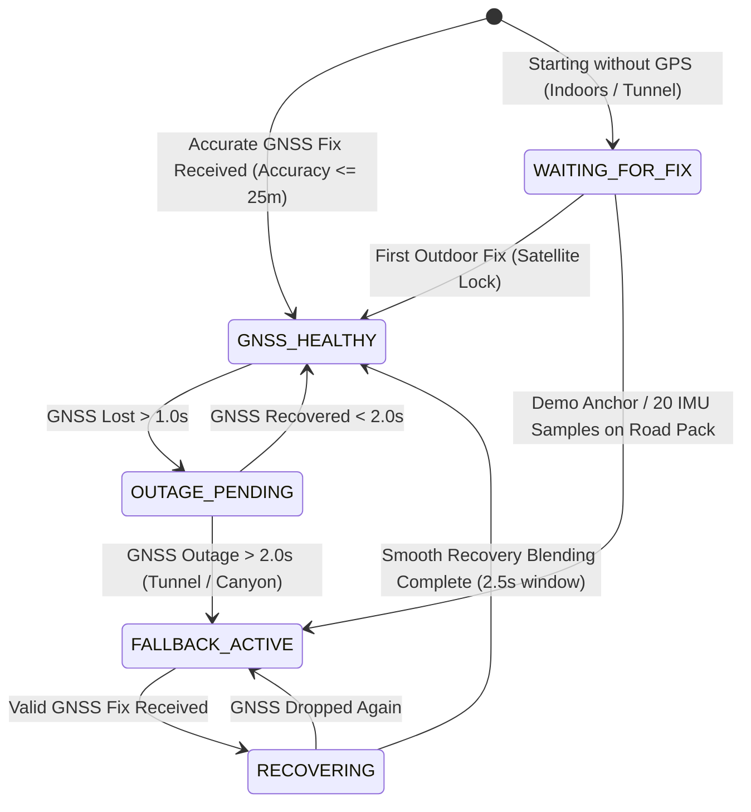

# Continuum IDR — System Architecture & Theoretical Framework

Continuum IDR (**Inertial Dead Reckoning**) is an autonomous navigation fallback system designed to sustain accurate vehicular positioning during temporary or prolonged GNSS (Global Navigation Satellite System) dropouts. It operates on edge hardware (smartphones, vehicle telematics, and in-dash automotive units) without requiring external wheel odometry, OBD-II cables, or active cellular connectivity.

---

## 1. High-Level System Architecture

The architecture is divided into three execution environments:
1. **The Core Python Navigation SDK & ML Engine** (`continuum_idr/`)
2. **The High-Performance Edge Runtime (Android Kotlin Engine)** (`android/`)
3. **The Web Telemetry & Evaluation Cockpit (Continuum Studio)** (`continuum_idr/studio/`)

```mermaid
flowchart TD
    subgraph SENSORS["Edge Sensing Layer"]
        IMU["3-Axis Accelerometer + 3-Axis Gyroscope\n(50–100 Hz Continuous Stream)"]
        GNSS["GNSS / GPS Receiver\n(1 Hz Satellite Fixes)"]
    end

    subgraph PREPROC["Preprocessing & Alignment"]
        GRAV["Gravity Estimator & Mount Normalization\n(Tilt Alignment & Dynamic Leveling)"]
        WIN["2.0s Causal Sliding Window\n(20 Samples @ 10 Hz Decimated)"]
        ZUPT["Zero Velocity Update (ZUPT)\n(Energy & Variance Detector)"]
    end

    subgraph INFERENCE["Edge Inference Pipeline (~110 µs)"]
        FEAT["42 Motion Features Extractor\n(Mean, Std, Min, Max, Energy, Deltas)"]
        TREES["HistGradientBoosting Speed Regressor\n(Portable Decision Trees)"]
        STOP["Logistic Regression Stop Classifier\n(Binary Motion Gating)"]
    end

    subgraph NAVIGATION["Kinematic Dead-Reckoning Engine"]
        YAW["Gyroscope Yaw Rate Integration\n(Heading Propagation with Motorcycle Lean)"]
        FLAT["Flat-Earth WGS-84 Coordinate Step\n(Distance & Azimuth to Delta Lat/Lon)"]
        UNCERT["Uncertainty Covariance Propagation\n(Dynamic Error Ellipse)"]
    end

    subgraph CORRECTION["Map & Topological Correction"]
        ROAD["Offline Vector Road Graph\n(Electronic City Corridor Pack)"]
        MATCH["Spatial Soft-Snapping Engine\n(Heading & Lateral Centerline Pull)"]
    end

    subgraph OUTPUTS["Ecosystem Integration & Fallback"]
        STUDIO["Continuum Studio\n(Desktop Simulation Cockpit)"]
        ANDROID_UI["Native Android HUD\n(Automotive Bento Cluster)"]
        MOCK_GPS["Android OS GPS Mock Provider\n(Feeds Google Maps / Waze / Uber)"]
        BLE["V2V Mesh Transport\n(BLE Local Hazard Broadcast)"]
    end

    SENSORS --> PREPROC
    PREPROC --> INFERENCE
    INFERENCE --> NAVIGATION
    NAVIGATION --> CORRECTION
    CORRECTION --> OUTPUTS
```

---

## 2. Mathematical Formulations & Core Principles

### 2.1 Coordinate Frames
Continuum IDR operates across three spatial reference frames:
1. **Body Frame ($B$):** Fixed to the smartphone. $X_B$ points right, $Y_B$ points up along the screen, and $Z_B$ points out of the screen.
2. **Vehicle Nav Frame ($V$):** Forward ($X_V$), Lateral ($Y_V$), and Vertical ($Z_V$).
3. **Local Geodetic Frame ($ENU$):** East-North-Up tangent plane anchored at WGS-84 reference origin $(\phi_0, \lambda_0, h_0)$.

### 2.2 Mount Alignment & Dynamic Leveling
Vehicles mount phones in varying orientations (portrait, landscape, tilted on dash mounts or handlebars). Continuum continuously estimates the local gravity vector $\mathbf{g}_B$ using a low-pass filter:

$$\mathbf{g}_{k} = \alpha \mathbf{g}_{k-1} + (1 - \alpha) \mathbf{a}_{\text{raw}, k}$$

The vertical axis unit vector is defined as $\hat{\mathbf{u}}_z = -\frac{\mathbf{g}}{\|\mathbf{g}\|}$. Sudden deviation in $\arccos(\hat{\mathbf{u}}_{z, k} \cdot \hat{\mathbf{u}}_{z, 0}) > 15^\circ$ triggers a mount-shift event, re-initializing the coordinate transformation.

### 2.3 Feature Extraction (42 Causal Features)
Over a causal $2.0\,\text{s}$ window $\mathbf{W} \in \mathbb{R}^{20 \times 6}$ consisting of linear acceleration $(a_x, a_y, a_z)$ and angular velocity $(\omega_x, \omega_y, \omega_z)$, 7 statistical operators are extracted across each channel $c \in \{0, \dots, 5\}$:
1. **Mean:** $\mu_c = \frac{1}{N} \sum_{i=1}^N x_{i, c}$
2. **Standard Deviation:** $\sigma_c = \sqrt{\frac{1}{N} \sum_{i=1}^N (x_{i, c} - \mu_c)^2}$
3. **Minimum:** $\min(x_c)$
4. **Maximum:** $\max(x_c)$
5. **Last Sample:** $x_{N, c}$
6. **Window Delta:** $x_{N, c} - x_{1, c}$
7. **Signal Root-Energy:** $E_c = \sqrt{\frac{1}{N} \sum_{i=1}^N x_{i, c}^2}$

$$\text{Feature Vector: } \mathbf{f} = [\mu_0, \sigma_0, \dots, E_0, \dots, \mu_5, \sigma_5, \dots, E_5]^T \in \mathbb{R}^{42}$$

### 2.4 Machine Learning Speed & Stop Prediction
Speed is estimated without mechanical wheel sensors using an ensemble of Histogram Gradient Boosting Trees:

$$\hat{v}_{\text{raw}} = \bar{v}_{\text{base}} + \sum_{m=1}^M \eta \cdot h_m(\mathbf{f})$$

Simultaneously, a regularized logistic classifier computes the stop probability $P(\text{stopped} \mid \mathbf{f})$:

$$z = w_0 + \sum_{j=1}^{42} w_j f_j, \quad P(\text{stopped}) = \frac{1}{1 + e^{-z}}$$

$$\hat{v} = \begin{cases} 0.0 & \text{if } P(\text{stopped}) \ge 0.50 \\ \min(\max(\hat{v}_{\text{raw}}, 0.0), 55.0) & \text{otherwise} \end{cases}$$

### 2.5 Kinematic Dead-Reckoning Step
Given predicted forward speed $\hat{v}_k$ and gyroscope yaw rate $\omega_{z, k}$ over time delta $\Delta t$:

$$\theta_k = \left( \theta_{k-1} + \omega_{z, k} \cdot \Delta t \right) \pmod{360^\circ}$$

The horizontal distance traveled is $d = \hat{v}_k \Delta t$. The displacements in the tangent local East and North frame are:

$$\Delta E = d \cdot \sin(\theta_k), \quad \Delta N = d \cdot \cos(\theta_k)$$

The WGS-84 coordinates update using local meridional and parallel radius approximations:

$$\phi_k = \phi_{k-1} + \frac{\Delta N}{111132.954}, \quad \lambda_k = \lambda_{k-1} + \frac{\Delta E}{111132.954 \cdot \cos(\phi_{k-1})}$$

### 2.6 Motorcycle Lean Angle Dynamics
For two-wheeled vehicles, turning produces a lateral roll/lean angle $\theta_{\text{lean}}$ governed by centripetal equilibrium:

$$\tan(\theta_{\text{lean}}) = \frac{\hat{v} \cdot \omega_z}{g} \implies \theta_{\text{lean}} = \operatorname{atan2}(\hat{v} \cdot \omega_z, 9.80665)$$

The Android engine tracks $\theta_{\text{lean}}$ in real time to correct lateral accelerometer bias during high-speed cornering.

---

## 3. Finite State Machine (Tracking State Lifecycle)

### State Definitions
1. **`GNSS_HEALTHY`:** Satellite lock active, horizontal accuracy $\le 25\,\text{m}$. Primary positioning is derived directly from the GNSS receiver while the IMU trains and anchors baseline biases.
2. **`OUTAGE_PENDING`:** Satellite signals have ceased for $> 1.0\,\text{s}$. The engine arms inertial estimators.
3. **`FALLBACK_ACTIVE`:** Outage confirmed ($> 2.0\,\text{s}$). Full Dead-Reckoning is engaged. Speed is inferred from the portable ML tree runner; heading is propagated from the gyroscope; positions are soft-snapped to offline road networks.
4. **`RECOVERING`:** GNSS signals return. To prevent jarring visual jumps, a smooth linear interpolation window ($2.5\,\text{s}$) gently merges the dead-reckoned trajectory into the ground-truth GNSS path:
   
$$\mathbf{p}_{\text{display}} = (1 - \alpha) \mathbf{p}_{\text{dead\_reckon}} + \alpha \mathbf{p}_{\text{gnss}}, \quad \alpha = \min\left(\frac{t - t_{\text{recovery}}}{2.5}, 1.0\right)$$

---

## 4. Map Matching & Road Snapping

Pure inertial navigation suffers from heading integration drift ($\sim 1^\circ - 3^\circ/\text{min}$). Over long tunnels, this causes the vehicle trajectory to drift laterally into walls or rivers.

Continuum IDR includes an **offline spatial road graph** format (`sample_road_pack.json`):
- Topological directed segments with start/end WGS-84 coordinates.
- Spatial bounding box cells for $O(1)$ nearest-neighbor candidate lookups.
- Soft-snapping formulation: when confidence $\ge 70\%$, heading difference $< 25^\circ$, and distance $< 30\,\text{m}$, the vehicle is pulled toward the road centerline with a $15\%$ damping weight:

$$\mathbf{p}_{\text{corrected}} = 0.85 \cdot \mathbf{p}_{\text{inertial}} + 0.15 \cdot \mathbf{p}_{\text{centerline}}$$
$$\theta_{\text{corrected}} = 0.96 \cdot \theta_{\text{gyro}} + 0.04 \cdot \theta_{\text{road}}$$
