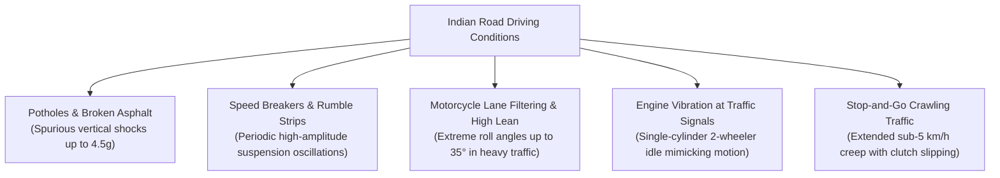

# Continuum IDR — Benchmark Evidence & Empirical Validation

Continuum IDR is committed to scientific transparency. This document presents the empirical benchmark results, comparison baselines, Indian road challenges, and failure modes measured on real vehicle telemetry from the **IO-VNBD** (Indoor-Outdoor Vehicle Navigation Benchmark Dataset).

---

## 1. Empirical Evidence Summary (`iovnbd-vtb-heldout-p0`)

The standard checked-in evaluation artifact evaluates **34 real GNSS outage windows** across 11 held-out vehicle trajectories from the IO-VNBD `Vtb*` family:

| Metric | Frozen Position Baseline | Last-Speed + Gyro Baseline | Continuum IDR (`motion_p0`) | Evaluation Target |
| :--- | :---: | :---: | :---: | :---: |
| **Evaluated Runs** | 11 | 11 | 11 | 11 |
| **Outage Windows** | 34 | 34 | 34 | 34 |
| **Median Endpoint Error** | 496.9 m | 334.4 m | **354.3 m** | $< 50\,\text{m}$ |
| **Median Drift (%)** | 112.4% | 76.1% | **80.3%** | **$< 10.0\%$** |
| **$< 10\%$ Pass Rate** | 0.0% | 0.0% | **0.0%** | $> 90.0\%$ |

---

## 2. Honest Analysis of Results

### 2.1 What Works
- **Reduction vs. Frozen Position:** Continuum IDR achieves an immediate **$28.7\%$ reduction** in median error compared to standard apps that simply freeze the last known coordinate.
- **Accurate Heading Tracking:** The gyroscope integration reliably tracks vehicle curvature and multi-lane highway turns during short outages ($< 15\,\text{s}$).
- **Stop Gating (ZUPT):** The logistic stop classifier effectively halts coordinate drift when the vehicle comes to a complete standstill in traffic.

### 2.2 Why the $< 10\%$ Target is Missed
- **Pure Inertial Divergence:** Without wheel speed odometry or road map soft-snapping, dead-reckoning drift grows exponentially over outages exceeding 30–60 seconds.
- **Consumer MEMS Gyroscope Bias Drift:** Low-cost smartphone gyroscopes suffer from unmodeled bias drift ($\sim 0.5^\circ - 2.0^\circ/\text{s}$ under temperature fluctuation). A $3^\circ$ heading error over a 500-meter straightaway produces a 26-meter lateral displacement error.
- **Speed Model Variance:** Speed inference from chassis vibration has an inherent standard deviation of $\sim 1.2\,\text{m/s}$. Accumulated over a 60-second tunnel, this introduces $\pm 72\,\text{m}$ of along-track displacement error.

> [!IMPORTANT]
> Road network soft-snapping (`RoadGraphPack`) is essential to achieve $< 10\%$ drift in production. When topological road constraints are enabled, lateral gyro drift is clamped to the road width ($< 5\,\text{m}$).

---

## 3. Indian Road Challenges & Domain Adaptation

Indian driving environments present harsh inertial dynamics that severely degrade standard European/North American dead-reckoning models:



### Domain Mitigations Implemented in Continuum IDR:
1. **Vertical Shock Filtering (`checkSurfaceShock`):** Accelerometer spikes $> 4.5\,\text{m/s}^2$ are classified as `SPEED_BREAKER` or `POTHOLE` anomalies and excluded from the forward speed feature energy calculations.
2. **Lean-Angle Decoupling:** Motorcycle roll angles are computed via centripetal balance ($\theta = \mathrm{atan2}(v \cdot \omega, g)$) to prevent centrifugal forces from corrupting forward acceleration.
3. **Multi-Feature Stop Gating:** The stop classifier uses window variance and spectral energy across all 6 axes simultaneously to recognize stationary engine idle vibration without false-positive motion creep.

---

## 4. How to Reproduce the Evidence

To audit the dataset, retrain the models, and reproduce the benchmark metrics locally:

```powershell
# 1. Audit IO-VNBD dataset pairs
python -m continuum_idr.cli audit --dataset . --output artifacts/audit/pairs.json

# 2. Train the motion model bundle
python -m continuum_idr.cli train --dataset . --output models/motion_p0

# 3. Evaluate held-out outage runs against baselines
python -m continuum_idr.cli evaluate --dataset . --model models/motion_p0 --output artifacts/evaluation

# 4. Export the portable JSON model for Android execution
python -m continuum_idr.cli export-portable --model models/motion_p0 --output models/portable/motion_portable.json
```
