# Continuum IDR — Google Maps & External Navigation Integration

This guide explains how Continuum IDR provides seamless navigation fallback for external applications like **Google Maps**, **Waze**, and **Uber**, as well as enterprise applications built with the **Google Maps SDK** or **Mapbox Navigation SDK**.

---

## 1. The Real-World Navigation Failure Mode

When a vehicle enters a tunnel, underpass, basement parking garage, or drives between high-rise skyscrapers (urban canyons):
1. Satellite signals drop or experience severe multipath distortion.
2. Standard navigation apps (Google Maps, Waze) freeze their position, spin erratically, or display *"Searching for GPS"*.
3. Drivers miss highway exits, tunnel forks, and underground turns.

Continuum IDR eliminates this failure mode by supplying uninterrupted dead-reckoned coordinates to navigation apps during satellite loss.

---

## 2. Integration Modes

Continuum IDR supports two integration models:

```mermaid
flowchart TD
    subgraph MODE_A["Integration Model A: OS System Mock GPS Relay"]
        IDR_A["Continuum IDR Mobile App\n(Runs in Foreground/Background)"]
        OS_GPS["Android OS Location Subsystem\n(LocationManager.GPS_PROVIDER)"]
        APPS["Official Google Maps / Waze / Uber App\n(Unmodified from Play Store)"]
        
        IDR_A -->|setTestProviderLocation| OS_GPS
        OS_GPS -->|Native GPS Stream| APPS
    end

    subgraph MODE_B["Integration Model B: Embedded SDK Integration"]
        APP_CUSTOM["Enterprise Navigation App\n(Logistics / In-Dash / Delivery)"]
        IDR_ENGINE["ContinuumLocationEngine\n(Embedded Kotlin SDK)"]
        MAP_SDK["Google Maps SDK / Mapbox SDK\n(Custom Location Engine / Source)"]
        
        IDR_ENGINE -->|LocationSource / LocationEngine| MAP_SDK
        MAP_SDK --> APP_CUSTOM
    end
```



---

## 3. Model A: Android System Mock GPS Relay (Consumer / Driver)

This mode requires zero code modifications to Google Maps. It uses Android's built-in Test Location Provider framework.

### How It Works Under the Hood
1. [`SystemMockRelay.kt`](file:///d:/iovnbd/IO-VNBD/android/app/src/main/java/ai/continuum/idr/SystemMockRelay.kt) registers a test provider for `LocationManager.GPS_PROVIDER`.
2. When satellite lock is healthy outdoors, Continuum allows the real GPS hardware to stream directly.
3. The instant an outage is detected (`FALLBACK_ACTIVE`), Continuum IDR's machine learning model and gyroscope begin computing dead-reckoned positions at 10 Hz.
4. Continuum calls `locationManager.setTestProviderLocation("gps", syntheticLocation)`.
5. Because Google Maps simply requests `GPS_PROVIDER` from Android OS, Google Maps receives Continuum's coordinates as if satellites were still active.

### How to Enable on Any Android Phone
1. Go to **Settings** → **About phone** → tap **Build number** 7 times to enable Developer options.
2. Go to **Settings** → **System** → **Developer options**.
3. Scroll down to **"Select mock location app"** → select **Continuum IDR**.
4. Open the Continuum IDR app and tap **"ENABLE MOCK GPS"** on the Google Maps Relay card.
5. Launch **Google Maps** (in split-screen or background) and drive into any tunnel or basement. The blue navigation arrow will continue tracking smoothly along the road.

---

## 4. Model B: Embedded SDK Integration (Enterprise Developers)

For developers building custom in-dash automotive software, fleet logistics apps, or delivery applications using map SDKs:

### 4.1 Google Maps Navigation SDK Integration
Google Maps allows providing a custom `LocationSource`:

```kotlin
// Inside your Activity or Fragment containing GoogleMap
val continuumEngine = ContinuumLocationEngine(
    context = this,
    portableRunner = PortableTreeRunner.fromJsonString(modelJson),
    vehicleProfile = ContinuumLocationEngine.VehicleProfile.CAR,
    roadGraphPack = roadPack
)

googleMap.setLocationSource(object : LocationSource {
    override fun activate(listener: LocationSource.OnLocationChangedListener) {
        continuumEngine.start(object : ContinuumLocationEngine.LocationUpdateCallback {
            override fun onLocationUpdate(
                location: Location,
                isFallback: Boolean,
                state: ContinuumLocationEngine.FallbackState
            ) {
                // Feeds Google Maps smoothly during both GNSS and Outage states
                listener.onLocationChanged(location)
            }
            override fun onSurfaceAnomaly(eventType: String, severity: Double) {}
            override fun onMountShiftDetected() {}
            override fun onRawGnss(location: Location) {}
            override fun onRawImu(sensorType: Int, timestampNs: Long, values: FloatArray) {}
        })
    }

    override fun deactivate() {
        continuumEngine.stop()
    }
})
```

### 4.2 Mapbox Navigation SDK Integration
Mapbox allows replacing the default location engine with an implementation of `LocationEngine`:

```kotlin
val mapboxNavigation = MapboxNavigationProvider.retrieve()
mapboxNavigation.navigationOptions.locationEngine = object : LocationEngine {
    override fun getLastLocation(callback: LocationEngineCallback<LocationEngineResult>) {
        // Return Continuum's latest blended coordinate
    }

    override fun requestLocationUpdates(
        request: LocationEngineRequest,
        callback: LocationEngineCallback<LocationEngineResult>,
        looper: Looper?
    ) {
        continuumEngine.start(object : ContinuumLocationEngine.LocationUpdateCallback {
            override fun onLocationUpdate(location: Location, isFallback: Boolean, state: ContinuumLocationEngine.FallbackState) {
                callback.onSuccess(LocationEngineResult.create(location))
            }
            // ...
        })
    }

    override fun removeLocationUpdates(callback: LocationEngineCallback<LocationEngineResult>) {
        continuumEngine.stop()
    }
}
```

---

## 5. Re-convergence & Smooth Handoff

A critical problem in fallback systems is **position jumping** when satellite signals return:
If dead-reckoning accumulated a 15-meter error inside a long tunnel, jumping immediately to the new satellite fix causes navigation apps to announce false turns.

Continuum IDR implements a smooth $2.5\,\text{s}$ linear blending window (`RECOVERING` state):

$$\mathbf{p}(t) = (1 - \alpha) \mathbf{p}_{\text{dead\_reckon}} + \alpha \mathbf{p}_{\text{gnss}}, \quad \alpha \in [0, 1]$$

This ensures Google Maps' navigation puck glides smoothly onto the verified GPS track without visual jerks or false rerouting recalculations.
