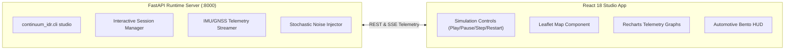

# Continuum Studio — Desktop Simulation & Telemetry Cockpit

Continuum Studio is an interactive, browser-based simulation and telemetry cockpit built for navigation researchers, autonomous vehicle engineers, and algorithmic evaluators. It pairs a **React 18 + Vite + Tailwind CSS** frontend with a high-throughput **FastAPI** backend daemon.

---

## 1. Studio Architecture & Visual Direction

The visual design follows a **70% scientific engineering instrument / 20% modern UI / 10% dark automotive cockpit** visual hierarchy:
- **Left Sidebar (220px):** Precision navigation controls, session parameters, and scenario selector.
- **Top Command Bar:** Dynamic playback controls, live status chips, and scenario restart.
- **Main Interactive Canvas:**
  - Multi-layer Leaflet vector map with true GNSS track, dead-reckoned trajectory, and uncertainty radius.
  - Multi-metric Bento instrument cluster (Speed, Heading, Drift Error, Map Match).
  - Real-time Recharts graphs (Speed comparison, Drift accumulation over time, IMU 6-channel energy).
- **Diagnostics Strip:** Live inference latency, step index, memory usage, and ZUPT status.



---

## 2. Interactive Features & Controls

### 2.1 Dynamic Scenario Selection
Studio supports switching between held-out evaluation datasets and synthetic edge-case scenarios on the fly:
- **Held-Out IO-VNBD Routes:** `Vtb01`, `Vtb02`, `Vtb03`, `Vtb04`, `Vtb05`, `Vtb06`.
- **Random Trip Generator:** Automatically synthesizes randomized urban, highway, and tunnel trajectories with authentic vehicle kinematics.

### 2.2 Stochastic Environmental Perturbations
To evaluate estimator resilience against real-world sensor imperfections, Studio features real-time perturbation injection:
1. **Stochastic MEMS Sensor Noise:** Injects Gaussian white noise ($\mathcal{N}(0, \sigma^2)$) and thermal drift into accelerometer and gyroscope channels.
2. **Road Bump Perturbations:** Simulates potholes, speed breakers, bridge expansion joints, and cobblestone surface vibrations.
3. **Randomized Scenario Seed:** Clicking **Restart / Re-roll** applies fresh stochastic perturbations, ensuring tests never produce identical deterministic loops.

### 2.3 Interactive GPS Kill Switch ("Trigger Satellite Outage")
At any moment during simulation, clicking the prominent **Trigger Satellite Outage** button instantly withholds satellite fixes:
- The engine's state transitions from `GNSS_HEALTHY` to `FALLBACK_ACTIVE`.
- The reference GNSS track continues invisibly in the background.
- Continuum IDR assumes sole navigational control via Dead Reckoning.
- The map highlights the growing uncertainty ellipse and road soft-snapping behavior in real time.
- Clicking **Restore GNSS** initiates the smooth $2.5\,\text{s}$ re-convergence filter.

### 2.4 Simulation Playback Speeds & Stepping
- **Play / Pause:** Freeze time at any millisecond to inspect individual tree splits or covariance values.
- **Single-Step (100 ms):** Step through time one IMU window at a time.
- **Speed Multipliers:** `0.5x` (slow motion inspection), `1.0x` (real-time), `2.0x`, and `5.0x` (fast evaluation).

### 2.5 Multi-Channel Telemetry Graphs
- **Velocity Tracking:** Real-time plot comparing estimated speed vs. ground-truth speed.
- **Cumulative Endpoint Drift:** Shows linear and percentage drift accumulation during the outage window.
- **IMU Dynamic Energy:** Displays raw accelerometer shocks and gyroscope yaw rates.

### 2.6 Session Export
Export complete simulation sessions as timestamped `.json` or `.csv` files for offline analysis in MATLAB, Python pandas, or Jupyter notebooks.

---

## 3. How to Launch Continuum Studio

### Step 1: Install Dependencies & Build Frontend
```powershell
# From project root
pip install -e .
cd continuum_idr/studio
npm install
npm run build
cd ../..
```

### Step 2: Start the Studio Server
```powershell
python -m continuum_idr.cli studio --host 127.0.0.1 --port 8000
```

### Step 3: Open in Browser
Navigate to:
- **Studio Interface:** `http://127.0.0.1:8000/`
- **Interactive OpenAPI Documentation:** `http://127.0.0.1:8000/docs`
- **Synchronized Driver HUD:** `http://127.0.0.1:8000/mobile`
