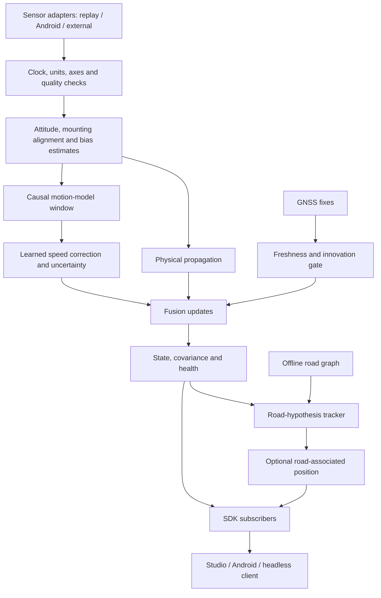

# 3. System architecture

## Design choice

Use a hybrid estimator: causal sensor processing, a compact learned motion model, and a physical filter. GNSS measurements enter the same running filter when accepted. Road matching operates on multiple hypotheses and produces a separate road-associated output before any feedback into the estimator is enabled.

P0 is a **planar vehicle odometry prototype**, not a complete strapdown 3D INS. P2/P3 evolve the engine toward an attitude-aware error-state inertial filter for gradients, external sensors, and broader motion.



The reference evaluator sits outside this graph. It reads predictions and withheld reference records, and cannot feed measurements back into the SDK.

## Frames and units

| Item | Contract |
| --- | --- |
| Sensor frame S | Native sensor axes, explicitly mapped by the adapter |
| Vehicle frame B | Right-handed: x forward, y left, z up |
| Navigation frame N | Local east, north, up (ENU), anchored to an accepted WGS84 fix |
| Mount rotation | `R_BS` rotates sensor-frame vectors into vehicle frame |
| Attitude quaternion | `q_NB`, stored w,x,y,z; maps vehicle-frame vectors into ENU |
| Internal yaw | Radians, counterclockwise from east |
| Public heading | Degrees clockwise from north; `(90 - yaw_deg) mod 360` |
| Acceleration / angular rate | m/s² / rad/s |
| Runtime time | Monotonic integer nanoseconds in one declared clock domain |

Android sensor axes and screen orientation are not interchangeable. Portrait/landscape UI changes must not silently rotate sensor data. Dataset gyro labels are not sufficient proof of an axis mapping; validate the mapping using recorded turns and the sensor convention.

## Alignment and gravity

1. Validate sensor timestamps, finite values, and saturation limits.
2. During credible low-dynamics periods, estimate the gravity direction and gyro bias. Gravity constrains tilt but does not determine yaw about the vertical.
3. Estimate the mounting yaw using a history containing usable acceleration/braking and accepted GNSS course while moving. Resolve forward/backward ambiguity using the motion history. Preserve low confidence when the maneuver is uninformative.
4. Transform the signals into the documented frame. In the dataset path, verify that acceleration and logged gravity share a convention before using `a_linear = a_measured - gravity`.
5. In the later inertial path, rotate corrected specific force into ENU and add the navigation-frame gravity vector. Do not both subtract sensor gravity and add gravity a second time.

A stationary record does not uniquely separate every accelerometer bias from tilt error. Record which calibration terms are estimated and which remain uncertain. A phone movement detector combines a change in mounting orientation with motion consistency; a road bump, bank, or vehicle turn must not automatically trigger re-alignment.

## P0 propagation and learned update

Initial proposed filter state:

```text
x = [east_m, north_m, forward_speed_mps, yaw_rad,
     forward_accel_bias_mps2, vertical_gyro_bias_radps]
```

Roll and pitch are handled by the alignment component; their uncertainty contributes to process noise. This approximation has limits on steep gradients and motorcycles.

For a small measured interval `dt`:

```text
a_forward = aligned_linear_accel_x - accel_bias
omega = aligned_gyro_z - gyro_bias
v_next = v + a_forward * dt
psi_next = wrap(psi + omega * dt)
p_next = p + v_mid * dt * [cos(psi_mid), sin(psi_mid)]
```

The implementation must propagate covariance through its Jacobian and process-noise model. Large sampling gaps are quality events, not normal steps to integrate indefinitely.

The model produces a proposed forward-speed estimate or a residual correction to the propagated speed, plus a positive uncertainty estimate and a stop probability. Prefer an anchored residual formulation as the main experiment: the state retains the last reliable velocity and the IMU explains subsequent changes. Compare it with a direct absolute-speed model.

Absolute constant speed is not generally observable from ideal accelerometer and gyro samples alone. A short window can be identical at different straight, constant speeds. Learned speed depends on motion history and data priors; neither a CNN nor a GRU removes that limitation.

Adjacent model windows overlap. Model errors also correlate with the IMU used in propagation. Treating every learned output as an independent high-confidence measurement would underestimate uncertainty. Begin with a conservative update interval and covariance floor, tune only on validation, and check empirical coverage. A later filter can explicitly model relative measurements and their correlations. TLIO provides a relevant example of learned relative motion and uncertainty combined with filtering, but its pedestrian results are not vehicle-performance evidence. [TLIO project](https://cathias.github.io/TLIO/)

## GNSS fusion, trust, and recovery

Use fresh GNSS position and, where trustworthy, speed/course. Maintain provenance: a phone's platform-fused location is not necessarily an independent raw GNSS observation.

For a candidate measurement, calculate innovation `r = z - h(x)`, innovation covariance `S = HPHᵀ + R`, and normalized innovation `rᵀS⁻¹r`. Select validation-tested gates appropriate to the measurement dimension. Include reported accuracy, timestamp age, and repeated-fix detection. Do not pretend that a sensor's arbitrary accuracy field is automatically a per-axis Gaussian standard deviation.

During an outage, propagation and learned motion continue. No estimator is torn down or restarted. After GNSS returns, require a credible sequence of fixes when needed, increase/decrease trust gradually, and report how the state is corrected. If the inertial state is badly wrong, repeatedly rejecting correct GNSS would be a failure; include a bounded re-initialization/recovery policy.

The status changes when evidence indicates loss, degradation, or recovery. An RF outage cannot be inferred instantaneously solely because the next 1 Hz fix has not arrived. Measure event-processing latency separately from missing-fix detection latency.

AI-assisted fusion starts with learned motion uncertainty. A later conditioner can adapt bounded noise terms using causal quality features and innovation history, compared against a fixed-covariance baseline. Adaptive covariance in vehicle dead reckoning has prior research; use it as a design foundation. [AI-IMU Dead-Reckoning](https://arxiv.org/abs/1904.06064)

## Stops and vehicle constraints

Apply zero-velocity updates only with sufficient stop evidence and hysteresis. A smooth constant-speed segment can resemble a stop in ideal IMU signals. Evaluate false stops in slow traffic and on smooth roads. ZUPT constrains velocity and can improve bias estimation; it does not erase accumulated position error or fix absolute heading.

In P0 the planar motion model already encodes approximately forward-only motion. Do not count that same assumption again as an independent zero-lateral-velocity measurement. In a later 3D error-state filter, NHC constrains lateral/vertical velocity in an appropriate vehicle/road frame under valid conditions. Banking, slip, bumps, lean, and gradients require uncertainty or relaxation; “vertical velocity is zero globally” is not valid on a ramp.

## Road matching

Maintain candidate road edges and progress along each edge. Score proximity, heading, connectivity, plausible traveled distance, and observed turn history. A known route can supply a prior if the user actually provides it; the held-out reference trajectory cannot supply that prior during evaluation.

Use a causal HMM or particle-style candidate tracker. Nearest-road snapping is only a diagnostic baseline. HMM map matching has established prior work that explicitly handles noisy location sequences. [Newson and Krumm](https://www.microsoft.com/en-us/research/publication/hidden-markov-map-matching-noise-sparseness/)

Keep `unmatched` and multiple-road states. A map can reduce lateral uncertainty on a correctly identified road, but does not automatically resolve road identity, along-road distance, parallel carriageways, or parking floors. A detected turn only corrects distance if the landmark association is sufficiently distinctive.

Initially expose matched output separately. Feedback into the filter needs bounded covariance and evidence that the same motion observation is not being counted twice. Preserve the unconstrained trajectory for evaluation and diagnostics.

## Runtime choices and evolution

| Layer | P0 choice | Later product path |
| --- | --- | --- |
| Research and training | Python, NumPy, PyTorch | Same training pipeline with versioned exports |
| Filter | Small documented NumPy implementation | C++ core with Python and Android bindings |
| Model inference | PyTorch for training; ONNX CPU for integration parity | ONNX Runtime on Android and edge |
| Service | FastAPI HTTP/WebSocket wrapper | Optional; not required by embedded core |
| Studio | Small TypeScript web app with a local map/trajectory view | Same backend protocol for replay and live diagnostics |
| Android | Not required for P0 | Kotlin sensor adapter, native runtime, offline map UI |
| Offline maps | Regional graph prepared on desktop | Versioned graph pack; separately packaged render assets |

ONNX Runtime documents Android Java/C/C++ deployment, enabling one chosen export path. Pin and test actual versions at implementation time. [ONNX Runtime mobile deployment](https://onnxruntime.ai/docs/tutorials/mobile/)

Propagate at the real sensor rate, form model windows at their trained rate, and publish state at the requested output rate. Downsample with anti-alias filtering. Interpolating 10 Hz data to 200 Hz supplies no new high-frequency motion information; a 200 Hz software path needs separate high-rate validation.
