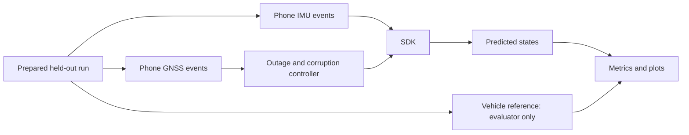

# 6. Evaluation protocol

## Purpose

Measure whether the SDK maintains useful navigation during GNSS loss, how uncertainty behaves, and whether the model adds value beyond simple kinematics. Preliminary results are not available yet. Populate the [results template](templates/RESULTS_TEMPLATE.md) only from generated experiment artifacts.

## Three isolated streams



P0 uses the phone GNSS stream as the time-aligned label/reference because equal-row S/V data can drift in time within a run. Phone GNSS is removed completely during test outages and remains available only to the evaluator. A later paired evaluation can use V-file speed/position after verified cross-clock alignment. The runtime uses the last accepted initial state and causal inputs. No map pack or initialization step may encode the future reference path.

## Outage construction

Use the same fixed outage schedules for all methods. Include distance windows of 50 m, 500 m, and 1 km where sufficient valid reference coverage exists. Add 2 km as stress testing, not an assumed pass. Separately evaluate duration windows such as 10, 30, and 60 seconds to expose stop-and-go behavior.

Predefine selection by valid reference coverage, adequate warm-up, and motion category. Save start/end timestamps before model comparison. P0 uses a documented 30-second aided warm-up before each outage; it begins from phone GNSS measurements and never initializes from the vehicle reference. Selecting endpoints by reference traveled distance is allowed in the offline evaluator; the engine does not receive the future endpoint or true traveled distance.

Use multiple start points across independent journeys and categories: straight steady speed, turns, acceleration, braking, slow traffic, and stops. Correlated overlapping windows must not be presented as independent drives. Report both window counts and parent-session counts.

The outage controller removes all GNSS-derived runtime channels for the entire interval: position, speed, course, freshness shortcuts, and any provider output known to retain GNSS information. Keep independent IMU-only attitude aids only when their provenance supports that classification.

Warm-up and pre-outage adaptation use only preceding accepted observations. Model selection, gate thresholds, and postprocessing are fixed on validation before final test reporting.

## Baselines

| ID | Method | Role |
| --- | --- | --- |
| B0 | Last known position held during blackout | Visual “GNSS-only hold” baseline; not a claim about Google Maps behavior |
| B1 | Last accepted speed + gyro heading | Strong simple outage baseline with the same entry state |
| B2 | Gravity-handled inertial/kinematic propagation with fixed-noise fusion | Non-ML estimator baseline |
| B3 | Learned motion + fusion, no map | Main ML contribution |
| B4 | B3 + validated stop/adaptation modules | Robustness contribution |
| B5 | B4 + causal map matching | Road-constraint contribution |

An oracle using true outage speed or reference heading can diagnose error sources, but must be visibly labeled **oracle, not deployable** and excluded from product performance claims.

## Position metrics

Compute horizontal errors in a common metric frame. Let `p_hat(t)` be the estimate and `p_ref(t)` the reference:

```text
absolute_error(t) = norm(p_hat(t) - p_ref(t))
endpoint_error = absolute_error(t_end)
relative_displacement_error = norm(
    (p_hat(t_end) - p_hat(t_start))
  - (p_ref(t_end) - p_ref(t_start)))
drift_percent = 100 * endpoint_error / reference_traveled_distance
```

Report both absolute endpoint error and relative displacement error, plus entry error. Relative displacement error reveals growth after entry but must not hide a bad initial absolute position.

Define reference traveled distance using a documented quality-controlled reference trajectory or independently validated reference speed integral. Dense repeated/noisy GNSS points can inflate distance; do not sum their jitter unquestioningly. Record the distance method and cross-check on clean segments.

For near-zero traveled distance, percentage drift is undefined or unstable. Report absolute position wander and false movement separately. Do not divide by an arbitrary tiny constant and call the result a benchmark.

For each method report endpoint error, maximum error during outage, horizontal RMSE, median/p95 across windows, pass rate for `<10%`, failures, and valid coverage. A pass rate alone can hide large mid-outage errors or excluded segments. Provide session-level summaries and uncertainty intervals using session-level resampling when there are enough independent sessions.

The supplied 50 m/5 m and 1 km/100 m examples follow the 10% target. At 60 km/h, 1 km takes 60 seconds. Report distance and duration together. Lane-level claims require a substantially different reference and error threshold.

## Other metrics

| Capability | Measurements |
| --- | --- |
| Speed model | MAE, RMSE, signed bias, stationary/moving/low-speed breakdown |
| Stops | Precision/recall, false-stop duration and induced position error |
| Recovery | First returned fix, first accepted fix, recovery time, estimator correction size |
| GNSS gate | False acceptance/rejection under specified injected faults; clean-fix behavior |
| Mount movement | Detection delay, false alarms during real turns/bumps, recovery error |
| Road matching | Road accuracy only where a reviewed road reference exists; unmatched/ambiguity rate |
| Uncertainty | Empirical coverage, interval/ellipse size, consistency stratified by outage duration |
| Deployment | Device/OS/runtime, model size, memory, CPU, thermal state, latency p50/p95/p99, deadlines missed |

In 2D, construct a confidence ellipse using the covariance and an appropriate probability threshold; “two times a standard deviation” is not automatically a 95% horizontal radius. If coverage has not been calibrated, label the display as estimated uncertainty rather than certified confidence.

## Why speed MAE alone is insufficient

A constant speed bias of 1 m/s causes about 60 m along-track error in 60 seconds. A constant heading error of 2 degrees yields about 35 m lateral error over 1 km. These simple budgets show why a good average speed metric can coexist with a failed position trajectory. Report sustained bias, heading behavior, and the actual integrated result.

## Robustness experiments

After the clean baseline, separately test delayed/dropped IMU samples, GNSS jumps, degraded reported accuracy, first-fix recovery, and synthetic mounting perturbations. Record each injection's exact configuration. Synthetic tests demonstrate response to that intervention, not universal detection of real jamming, spoofing, potholes, or phone movement.

Magnetic anomalies, long straight outages, parallel roads, and uninformative constant-speed periods should appear among failure analyses. Evaluate motorcycle or external-IMU accuracy only with appropriate real data and references.

## Required outputs for every experiment

```text
experiment_manifest.json   # data, split, model, profile and configuration hashes
outages.csv                # frozen windows, categories and exclusion reasons
predictions.csv            # causal engine states with timestamps and covariance
metrics_per_outage.csv      # measurements including failed cases
summary.json               # aggregate metrics and denominators
trajectory.png             # reference, baselines, estimate, outage boundaries
error_vs_time.png           # measured error and outage duration
speed_vs_time.png           # reference and predicted speed
uncertainty_coverage.png    # calibrated/uncalibrated status clearly stated
runtime_report.json        # measured hardware and timing
```

The video’s attractive demonstration run must link to its experiment ID. Select a representative held-out run using a declared rule, and show aggregate results including failures. Never present a favorable manually chosen run as the entire evaluation.

## Functional verification before filming

- SDK state from Studio and the headless client agrees for the same event stream.
- Withheld GNSS and future reference values cannot reach feature construction, adaptation, map matching, or initialization.
- Units, axis rotations, heading wrap, clock conversion, and reset behavior have meaningful tests.
- A stale GNSS repeat does not create repeated independent corrections.
- Exported model predictions and full trajectories agree with the training runtime within a declared tolerance.
- UI smoothing does not change saved estimator states or benchmark metrics.
- Metrics can be recalculated from saved predictions/reference without rerunning the UI.
