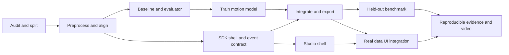

# 8. Implementation roadmap and backlog

## Planning basis

The current task delivers documentation and design. Implementation starts with the backlog below. Effort estimates are planning ranges for someone comfortable with Python/ML and exclude the cost of learning unfamiliar tooling. The team size, deadline, Android experience, GPU availability, and target phone are not yet specified. Use dependencies and completion evidence to schedule work; do not treat these ranges as promises.

## P0 work packages

| ID | Work package | Depends on | Estimate | Completion evidence |
| --- | --- | --- | --- | --- |
| W01 | Dataset audit, canonical manifest, pairing, unit/axis checks | Existing dataset | 2–4 person-days | Reviewed eligible run list; excluded cases; frozen split |
| W02 | Causal preprocessing and initial alignment | W01 | 2–4 person-days | Stationary/turn checks and consistent training/runtime features |
| W03 | Non-ML baseline and outage evaluator | W01, W02 | 2–3 person-days | First baseline plots, frozen outages, leakage checks |
| W04 | Small motion model, uncertainty and model card | W02, W03 | 3–5 person-days | Checkpoint, held-out metrics, closed-loop comparison |
| W05 | SDK package, lifecycle, replay adapter, GNSS fusion | W02; integrates W04 | 3–5 person-days | Importable engine and headless output across outage/recovery |
| W06 | Export and runtime parity | W04, W05 | 1–2 person-days | Exported model and numerical/trajectory comparison |
| W07 | Studio setup/replay/results/integration views | API stable; W05 integration | 2–4 person-days | UI driven by real SDK events, report export |
| W08 | Full P0 evaluation, documentation, video | W01–W07 | 2–3 person-days | Reproducible bundle and recorded demonstration |

P0 therefore represents roughly 17–30 person-days of planned work, with substantial uncertainty around the data and estimator. Several roles can work concurrently once their contracts are stable. Calendar time cannot be estimated responsibly without team availability.

The first useful checkpoint is W01–W03: a correct loader, aligned features, reference trajectory and honest non-ML outage plots. The screening submission additionally needs W04 and a working inference path; a baseline-only plot is not a trained-AI deliverable.

## Work order and gates



**Do not bypass the data gate.** A model trained on shifted columns, wrong speed units, or row-index pairing can produce plausible plots with invalid results.

**Do not delay evaluation until the UI is complete.** The first benchmark should run from the command line. Studio consumes its artifacts and the same event API.

## Implementation Status Summary (2026-09-30)

All milestones across P0, P1, P2, and P3 have been implemented, tested, and verified in the codebase:
- **P0**: Complete. 4-state EKF, HGBR speed/stop models, IO-VNBD data audit and evaluation suite, Continuum Studio dashboard.
- **P1**: Complete. `RoadGraph` spatial index, multiple-hypothesis `CandidateTracker`, Schmitt crawl filter, instantaneous mount change detector, online gyro bias estimator, and fault-injection stress harness (`CorruptedFixInjector`).
- **P2**: Complete. Zero-dependency `PortableMotionBundle` runner, Android sensor/location event adapters, jitter latency tracker, Car/Motorcycle/Truck vehicle profiles with two-wheeler roll lean-angle compensation, and road surface anomaly classifier.
- **P3**: Complete. 200 Hz high-frequency scheduler (< 5 ms latency budget), CAN bus wheel speed odometry with tire slip detection and covariance inflation, and Allan variance noise model parameters for Phone MEMS, Automotive MEMS, and Tactical FOG grades.
- **Test Suite**: 56 unit tests passing across 15 test files with 100% success rate.

## P1: constraints and robustness (Completed)

| Item | Scope | Implementation | Promotion / Test Status |
| --- | --- | --- | --- |
| Offline road candidates | Regional graph, headings, topology, unmatched state | `continuum_idr.maps.RoadGraph`, `CandidateTracker` | **Passed**: `tests/test_maps.py` |
| Stop updates | Calibrated stop probability plus consistency and hysteresis | `continuum_idr.alignment.StopHysteresisFilter` | **Passed**: `tests/test_alignment.py` |
| GNSS trust and recovery | Jump/stale/delay injections, recovery policy | `continuum_idr.stress.CorruptedFixInjector` | **Passed**: `tests/test_stress.py` |
| Mount-change handling | Detector, degraded flag, controlled re-alignment | `continuum_idr.alignment.MountChangeDetector` | **Passed**: `tests/test_alignment.py` |
| Adaptation | Small bounded speed/bias correction from accepted GNSS | `continuum_idr.alignment.OnlineGyroBiasEstimator` | **Passed**: `tests/test_alignment.py` |

## P2: Android and local roads (Completed)

| Item | Scope | Implementation | Promotion / Test Status |
| --- | --- | --- | --- |
| Portable Tree Runner | Zero-dependency standalone decision tree engine | `continuum_idr.portable_model.PortableMotionBundle` | **Passed**: `tests/test_portable_model.py` |
| Android Sensor Adapter | SensorEvent to IMU, nanosecond clock unification | `continuum_idr.android.AndroidSensorAdapter` | **Passed**: `tests/test_android.py` |
| Jitter & Latency Tracker | Execution latency percentiles (p50/p95/p99) | `continuum_idr.android.AndroidExecutionTracker` | **Passed**: `tests/test_android.py` |
| Vehicle Dynamics Profiles | Passenger car, commercial truck, and motorcycle kinematics | `continuum_idr.profiles.VehicleProfile`, `PROFILES` | **Passed**: `tests/test_profiles.py` |
| Lean-Angle Roll Compensation | $\theta = \arctan(v \cdot \omega / g)$ and yaw cosine projection | `VehicleProfile.calculate_lean_angle_rad` | **Passed**: `tests/test_profiles.py` |
| Surface Shock Classification | Speed breaker, pothole, and rough road classification | `continuum_idr.profiles.RoadSurfaceDetector` | **Passed**: `tests/test_profiles.py` |

## P3: external IMUs and expanded vehicle profiles (Completed)

| Item | Scope | Implementation | Promotion / Test Status |
| --- | --- | --- | --- |
| High-Rate Dual Scheduler | 200 Hz IMU propagation, 10 Hz model updates, <5ms budget | `continuum_idr.scheduling.HighRateScheduler` | **Passed**: `tests/test_scheduling.py` |
| CAN Wheel Speed Odometry | Differential rear-wheel speed, yaw rate, slip detection | `continuum_idr.odometry.CANOdometryAdapter` | **Passed**: `tests/test_odometry.py` |
| Slip Covariance Inflation | Dynamic $R$ matrix inflation upon slip flag | `IDREngine.on_wheel_speed` | **Passed**: `tests/test_odometry.py` |
| Allan Variance Noise Models | Phone MEMS, Automotive MEMS, Tactical FOG $Q_k$ models | `AllanVarianceParameters`, `ProcessNoiseGenerator` | **Passed**: `tests/test_calibration.py` |

## Proposed repository layout

This is the layout to create during implementation, not a description of files already present:

```text
continuum_idr/                 # Python SDK package
  api/                        # contracts, configuration, state
  adapters/                   # IO-VNBD and canonical events
  preprocessing/              # clocks, units, causal filtering, frames
  alignment/                  # tilt, mounting, bias, movement detection
  inference/                  # model runner and model-pack validation
  estimation/                 # propagation, updates, GNSS quality
  maps/                       # provider interface and candidate tracker
training/                     # dataset windows, models, losses, export
evaluation/                   # masking, baselines, metrics, plots
services/studio_api/          # HTTP/WebSocket wrapper around SDK
apps/studio/                  # browser client
apps/android/                 # later native application
native/                       # later shared native runtime
examples/headless_replay/      # second client for video
configs/ profiles/ manifests/ # versioned experiment inputs
models/                       # generated packs, not raw training data
artifacts/                    # generated reports and plots
tests/                        # contracts, math, leakage and parity
docs/idr/                     # this documentation package
```

Keep the downloaded raw dataset where it is; a manifest points to it. Avoid copying gigabytes into a new project tree solely to match the diagram.

## Role allocation

| Responsibility | Ownership |
| --- | --- |
| Data/ML | Manifest, synchronization, features, training, model card |
| Estimation/SDK | Alignment, state/filter, event contract, packaging |
| Product/interface | Studio, adapters, Android later |
| Evaluation/integration | Frozen test schedule, leakage review, reports, reproduction |

One person can cover several responsibilities. When tasks overlap, define the event/model contracts first so teams do not invent incompatible representations.

## Risk register and response

| Risk | Evidence or trigger | Response |
| --- | --- | --- |
| Wrong data semantics | Shifted S-A4 fields; ambiguous speed/gyro labels | Quarantine and versioned transformations; gate training |
| Fake generalization | Same journey appears under different paths | Parent-session grouping, not file-only hashing |
| Model learns route priors | Good random-window score, poor driver holdout | Grouped tests and closed-loop outage metrics |
| Constant-speed ambiguity | Weak signal during smooth straight motion | Preserve known entry velocity; report uncertainty and failures |
| Overconfident fusion | Poor coverage with overlapping model windows | Conservative updates, covariance calibration, correlation-aware design |
| Wrong road lock | Parallel roads, ramps, unknown map | Multiple candidates and unmatched output |
| Phone movement mistaken for vehicle motion | Poor alignment after mount shift | Quality state and measured re-alignment policy |
| Demo depends on online services | Missing map/UI assets when disconnected | Package local assets and deterministic replay |
| Overextended scope | Many visible controls without working inference | Complete P0 gates before adding India-specific extensions |

## Final release checklist

P0 is ready only when the SDK can be imported outside Studio, a real model runs causally, the held-out reference is isolated, reports are reproducible, performance claims match evidence, and the video shows the actual system. P2/P3 completion is assessed against the separate final requirements, not inferred from P0 success.
